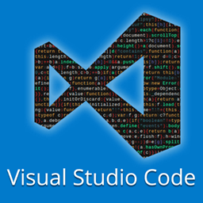

# Tips and Tricks for getting the most out of VS Code

Overview

1. Creating better Markdown Documents
2. Becoming proficient in Emmet
3. Refactoring code with VS Code
4. Type-Checking JavaScript!
5. Debugging

## Creating Better Markdown Documents

You can use a lot of HTML elements inside your markdown to create better markdown documents.

### Images

To insert an image and have full control over its size attributes, you can use the HTML IMG tag such as
`` 
You cannot use complex things such as srcset but for basic formatting this should do.

### Align

The `align` attribute works on most elements including `<p>` tags.

```html
<p align="right">right</p>
<p align="center">center</p>
<p align="left">left</p>
```

<p align=right>right</p>
<p align=center>center</p>
<p align=left>left</p>

### Lists

#### Unordered Lists

Unordered lists can be nested using indentation

```md
- one
  - two
    - three
      - four
```

- one
  - two
    - three
      - four

#### Ordered Lists

Ordered lists cannot be nested in most markdown rendering engines

```md
1. first
1. second
1. third
```

1. first
1. second
1. third

But we can use HTML tags instead

```html
<ol type="A">
  <li>first</li>
  <li>second</li>
  <li>third</li>
  <ol type="a">
    <li>fourth</li>
    <ol type="i">
      <li>fifth</li>
    </ol>
  </ol>
</ol>
```

<ol type='A' >
  <li> first </li>
  <li> second </li>
  <li> third</li>
  <ol type='a' >
    <li> fourth </li>
    <ol type='i' >
      <li> fifth </li>
    </ol>
  </ol>
</ol>

#### Definition Lists

We can also use the HTML `<dt> <dl>` tags to create definitions:

```html
<dl>
  <dt>Images</dt>
  <dd>.jpg, .gif, .png</dd>
  <dt>Styles</dt>
  <dd>.css</dd>
  <dt>Scripts</dt>
  <dd>.js</dd>
  <dt>Documents</dt>
  <dd>.html</dd>
</dl>
```

 <dl>
   <dt>Images</dt>
   <dd>.jpg, .gif, .png</dd>
   <dt>Styles</dt>
   <dd>.css</dd>
   <dt>Scripts</dt>   <dd>.js</dd>
   <dt>Documents</dt>
   <dd>.html</dd>
 </dl>

### Details

We can use the HTML `<details>` and `<summary>` tags to hide certain details with an arrow in our markdown

```html
<details>
  <summary>Click me!</summary>

  Some amazing things were hidden here!
</details>
```

<details>
  <summary>Click me!</summary>

Some amazing things were hidden here!

</details>
<br>

This is especially useful for example for when sending a error message in a PR in GitHub, you can hide the details so people don't have to scroll through long error messages.

### Tables

We can make tables easily, by writing down ASCII art:

```md
| Item      | Price  | Qty |
| --------- | ------ | --- |
| 🍇 Grapes | \$2.99 | 3   |
| 🍐 Pears  | \$4.15 | 1   |
| 🍋 Lemons | \$0.99 | 2   |
```

| Item      | Price  | Qty |
| --------- | ------ | --- |
| 🍇 Grapes | \$2.99 | 3   |
| 🍐 Pears  | \$4.15 | 1   |
| 🍋 Lemons | \$0.99 | 2   |

## Becoming proficient in Emmet

Emmet speeds up repetitive tasks with tab key. Most useful for creating HTML and CSS files. Think of it the way CSS selectors work for DOM generation. Emmet is built into VS Code so we don't need to install a plugin to use it in VS Code.

You don't need to care about emmet readability because it's disposable. You hit tab and it's gone.

### Using Emmet in HTML

By default it generates a div element but it has some idea of the surrounding elements so if you type `span>span` it will create `<span><span></span></span>` or `ul>li` will create `<ul><li></li></ul>` but it only looks at the string and once the tab is hit and the HTML is generated, it doesn't look at the outside context anymore.

Similar to CSS, there is a direct descendant selector `>` and sibling selector `+` so
`ul>li.special-item` will create:

```html
<ul>
  <li class="special-item"></li>
</ul>
```

whereas `.navbar+.content+.footer` will create

```html
<div class="navar"></div>
<div class="content"></div>
<div class="footer"></div>
```

As siblings of each other. There is also a climb up operator `^` but it's easier to just use parentheses:

`div+div>(p>(span+em))+bq`

```html
<div></div>
<div>
  <p><span></span><em></em></p>
  <blockquote></blockquote>
</div>
```

But if you have to put too much mental effort into emmet, then it's probably not worth it. It's easier to just use simple emmet commands and generate the html.

Multiplication is also useful, so `ul.col>li.col-item*5`

```html
<ul class="col">
  <li class="co-item"></li>
  <li class="co-item"></li>
  <li class="co-item"></li>
  <li class="co-item"></li>
  <li class="co-item"></li>
</ul>
```

And you can add text to the body of the item by using `{}` such that `ul.col>li.col-item*5{some text}*5` becomes:

```html
<ul class="col">
  <li class="co-item">some text</li>
  <li class="co-item">some text</li>
  <li class="co-item">some text</li>
  <li class="co-item">some text</li>
  <li class="co-item">some text</li>
</ul>
```

You can use the `$` inside the `{}` so that the text has consecutively counting numbers in it, such that `ul.col>li.col-item*5{some text $}*5` becomes:

```html
<ul class="col">
  <li class="col-item">some text 1</li>
  <li class="col-item">some text 2</li>
  <li class="col-item">some text 3</li>
  <li class="col-item">some text 4</li>
  <li class="col-item">some text 5</li>
</ul>
```

### Using Emmet in CSS

Inside an element, we can use emmet as well, so `p10` becomes:

```css
padding: 10px;
```

and `c#0` becomes:

```css
color: #000000;
```

and `gtc1fr` becomes:

```css
grid-template-columns: 1fr;
```

For multi-name css properties in general, emmet uses the initial letter of each word.

The value aliases for units are: `p` for percent, `e` for `em`, `r` for `rem` and `px` for pixels. So `lh1.5r` becomes:

```css
line-height: 1.5rem;
```

Any new line or space finishes the emmet, so basically it stops it from working so you need to generate your html or css before hitting space or return. There is no reason to construct complex convoluted emmet commands, just go two steps deep and construct small snippets and build from there.

## VS Code and git

VS Code has a full git UI built in. To bring it up, press `Ctrl + Shit + g`. You can write your commit message and press `Command + Enter` to commit it, and if the changes are not staged yet it will ask you and can stage them first before committing.

VSC also provides a diff so you can see everything that has been changed since the last commit. The diff can be viewed either side by side (which is the default). clicking on the number next to the filename brings up the diff but this can also be toggled with inline view to show the diff in a more traditional way using colour highlighting.

Many common git commands from push and pull to creating new branches can be performed inside VS Code, but probably the most useful is to commit the file you are currently working on and view diffs. You can also view the file as it currently exists in HEAD.

The number of files with unsaved changes, and the number of files with pending commits are also highlighted helpfully in the side bar. If your side bar is not in view you can toggle it using `Cmd + B`.

## Useful keybindings

- `Cmd + D` selects the word where the cursor is located. If pressed again, it will also select the subsequent occurrences of the word (with multiple cursors).
- `` Ctrl + ` `` will open the terminal
