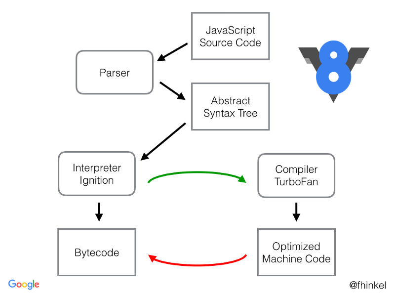
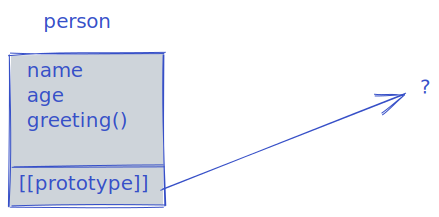
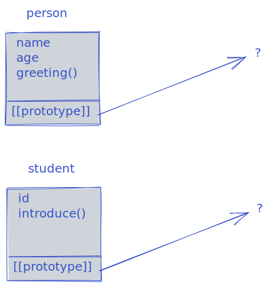
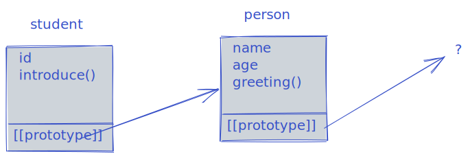
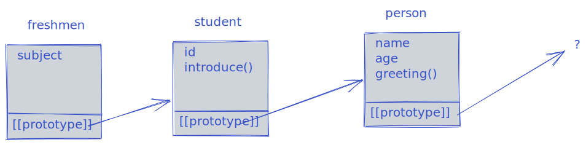
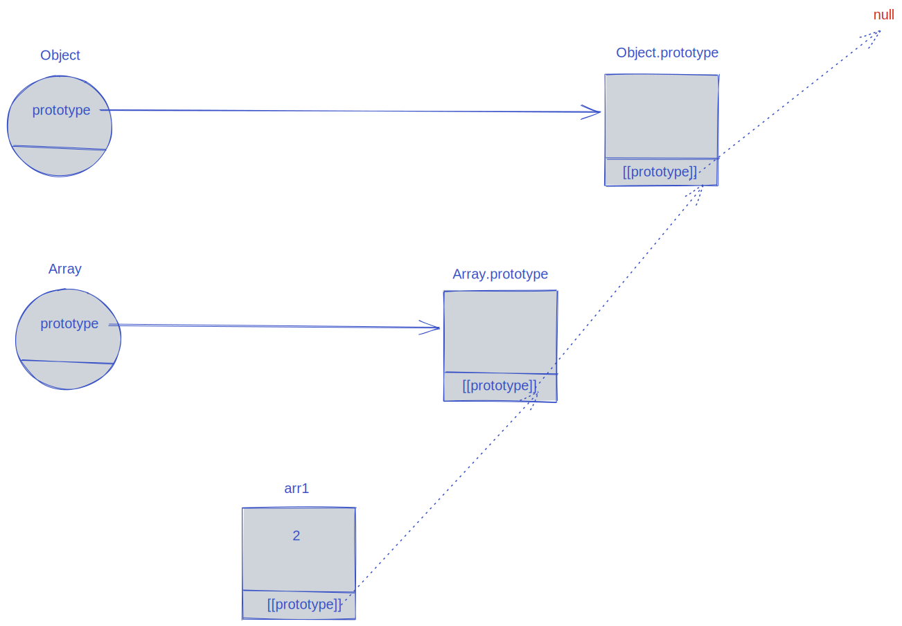
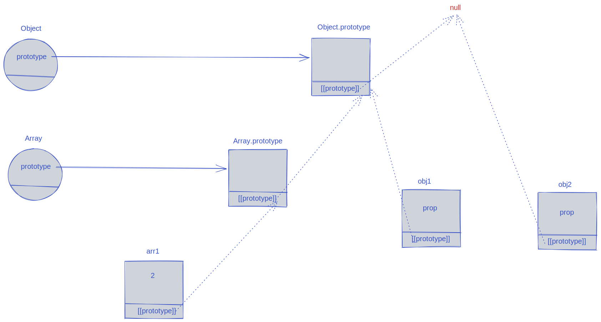

# Deep JS Foundations V3

In this series, we'll do a deep dive into the foundations of JavaScript. This series is geared towards the intrepid web developer who has a fair understanding of using JavaScript and wants to delve a bit more into its internals to see how it _really_ works. If you've been able to follow my [Mastering Hard Parts of JavaScript](https://dev.to/ryanameri/mastering-hard-parts-of-javascript-callbacks-i-3aj0) series, you're good to go!

- What exactly is the difference between `==` and `===`? _(hint: if you think that `==` doesn't check the types, you are wrong!)_
- Why was `let` and `const` introduced in JavaScript and what do they actually do?
- What's the difference between a function declaration and function expression? What is this "hoisting" you keep seeing?
- Where should you use arrow functions and where should you avoid them?
- Should you avoid using `this`? When should you use a namespace object and when should you use a module?

The blog series is based on [Kyle Simpson's](https://twitter.com/getify?lang=en) excellent [Deep JavaScript Foundations v3](https://frontendmasters.com/courses/deep-javascript-v3/introduction/) course on Frontend Masters.

Though the content and the presentation are my own, this blog series owes a heavy debt to Getify for his excellent structure of material and for obviously being the _source of truth_ when it comes to JavaScript. I'd highly encourage everyone take the course if they can and to read his [You Don't Know JS](https://github.com/getify/You-Dont-Know-JS) book series.

<h3 align="center"> Whenever there's a divergence between what your brain thinks is happening, and what the computer does, that's where bugs enter code <em> - getify's law #17</em></h3><br>

If we want our code to have less bugs, we need to get better at understanding what the computer does. For web developers, that means understanding how JS works.

We'll cover the following "Pillars of JavaScript" in this series:

1. Types
   - Primitive Types
   - Abstract Operations
   - Coercion
   - Equality
   - Statically typed supersets e.g., TypeScript
2. Scope
   - Nested Scope
   - Hoisting
   - Closure
   - Modules
3. Objects
   - this
   - class
   - Prototypes

## Types

When it comes to JavaScript and types, misconceptions are aplenty. Two of the most common misconceptions that many newbies to JavaScript have are:

### ~~JavaScript has no types~~

Many newbies to JavaScript have heard that _"JavaScript has no types"_. This might confuse some people but this is actually incorrect. JavaScript has types, and types are an extremely important concept to understand properly. It's just that like most other dynamically types languages, _variables_ don't have types. It's _values_ that have types.

```js
let time = "15:30";
```

Here, the variable `time` does not have a type. However `"15:30"` is a _value_ of type _string_. Variables can hold values of any type.

### ~~In JavaScript everything is an object~~

This also is a common misconception (perhaps it was more common in earlier days) but in fact JavaScript has primitive types that are not objects, such as number and string. A feature of JavaScript is _boxing_, the ability for primitive types to _act_ like objects. This is what allows us to write a statement such as `"A common string".toUpperCase()` and have it return `"A COMMON STRING"` to us, it makes a primitive type temporarily act as an object. However it's important to know the difference between primitive types, so let's go over them quickly.

### Primitive Types

- undefined
- string
- number
- boolean
- object
- symbol
- BigInt
- null? (it's a type but the historical bug...) (perhaps write a note about JavaScript backwards compatibility here)

- the `typeof` operator always returns a string.
- `undefined` and `undeclared` are entirely different concepts.
- There is also another concept (TDZ) or `uninitialised`. It was added in ES6.

### Special Values

#### NAN

- NaN: It's not "not a number". It's "invalid number".
- There is nothing you can do with NaN that will result in anything other than NaN.
- NaN is the only value in JS that is not equal to itself.
- isNaN() is first going to coerce the input into a number before determining if it is NaN
- Number.isNaN() does not perform that coercion. It was added in ES6. Better to check for NaN with this:

```js
isNaN("cat"); //true
Number.isNaN("cat"); // false
```

#### Negative Zero

```js
let trendRate = -0;
trendRate === -0; //true
trendRate.toString(); //returns "0", oops
trendrate === 0; //true; another historical bug.
// So now we have this method of checking for -0
Object.is(trendRate, -0); //true
Object.is(trendRate, 0); //false
//Object.is() was added in ES6 and is better way of checking
```

### Fundamental Objects

This used to be called "native functions" or "built-in objects".

Use the `new` keyword for:

- Object
- Array
- Function
- Date
- RegExp
- Error

Don't use `new` with:

- String
- Number
- Boolean

## Exercise 1: Polyfill Object.is()

1. `Object.is(..)` should take two parameters.
2. It should return `true` if the passed in parameters are exactly the same value (not just `===` -- see below!), or `false` otherwise.
3. For `NaN` testing, you can use `Number.isNaN(..)`, but first see if you can find a way to test without usage of any utility?
4. For `-0` testing, no built-in utility exists, but here's a hint: `-Infinity`.
5. If the parameters are any other values, just test them for strict equality.
6. You cannot use the built-in `Object.is(..)` -- that's cheating!
7. You have implemented the solution correctly if all of the console.log() print `true`

```js
Object.is = function ObjectIs() {};

// tests: Everything should output true
console.log(Object.is(42, 42) === true);
console.log(Object.is("foo", "foo") === true);
console.log(Object.is(false, false) === true);
console.log(Object.is(null, null) === true);
console.log(Object.is(undefined, undefined) === true);
console.log(Object.is(NaN, NaN) === true);
console.log(Object.is(-0, -0) === true);
console.log(Object.is(0, 0) === true);

console.log(Object.is(-0, 0) === false);
console.log(Object.is(0, -0) === false);
console.log(Object.is(0, NaN) === false);
console.log(Object.is(NaN, 0) === false);
console.log(Object.is(42, "42") === false);
console.log(Object.is("42", 42) === false);
console.log(Object.is("foo", "bar") === false);
console.log(Object.is(false, true) === false);
console.log(Object.is(null, undefined) === false);
console.log(Object.is(undefined, null) === false);
```

### Exercise 1 Solution



### Exercise 1 Kyle's Solution



## Abstract Operations: Turning Fundamental Objects into Primitives

Many built-in functions in JavaScript expect a primitive type as value, so when for example we `console.log` an object or we alert a number, these functions need to have a way to turn them into strings. This is where abstract operations come in.

There are 3 types (hints) of abstract operations:

- "string" (for alert and other operations that need a string)
- "number" (for maths)
- "default"

The specification describes explicitly which operator uses which hint. There are very few operators that “don’t know what to expect” and use the "default" hint. Usually for built-in objects "default" hint is handled the same way as "number", so in practice the last two are often merged together.

The conversion algorithm is:

- If the object has a `obj.toPrimitive(hint)` method, call that.
- Otherwise, if hint is "string", call `obj.toString()` and `obj.valueOf()`, in that order.
- Otherwise if hint is "number" or "default", call `obj.valueOf()` and `obj.toString()`, in that order.
- toBoolean is a simple lookup table. If a [falsy value](https://developer.mozilla.org/en-US/docs/Glossary/Falsy) is encountered, it will convert to `false`, everything else is converted to `true`. All objects are truthy.

There are many corner cases with abstract operations so we have to be extremely careful using them in production.

You can find more information on abstract operations [here](https://javascript.info/object-toprimitive).

## Boxing

Boxing can be thought of as the opposite of Abstract Operations. You can access properties of primitives and JavaScript makes them act like objects. In effect, boxing is a form of implicit coercion (primitive to object).

Example of boxing:

```js
console.log("testing".toUpperCase());
```

## Intentional/Explicit Coercion

We'll use the terms coercion and conversion interchangeably here, though from a CS point of view there can be minor differences between the two. This concept is also called "casting" in some languages.

Unlike what some others advocate, as a web developer, you cannot simply avoid coercion and conversion. You have to embrace it, making sure that the types involved in any operation are clear. Yes there are corner cases, but they can be safely managed by learning them, instead of avoiding them.

The `===` is not a magic bullet that fixes all conversions. Implicit coercion is everywhere in JavaScript, for example:

```js
let num = 4;
console.log(`This number is ${num}`);
```

Can you guess what kind of coercion is happening in this simple console.log? As it turns out, console.log only outputs string, so `num` is being implicitly converted to a string.

You could of course write:

```js
let num = 4;
console.log(`This number is ${String(num)}`);
```

To be more explicit, but this level of being explicit adds verbosity without adding much value. There is a balance of clarity vs. verbosity that needs to be struck.

- Implicit does not mean "magical". Implicit is not in itself bad. We need to think of implicitness as an abstraction. Not all abstractions are good, but some abstractions _are_.

Those familiar with functional programming know that abstractions allow us to hide unnecessary details by re-focusing the reader and increasing clarity. Implicit coercion is very similar, a level of abstraction.

However let's take a look at a different example:

```js
let item1 = document.getElementById(item1);
let item2 = document.getElementById(item2);

if (item1 < item2>){
    //Do something
}
```

Here, interfacing with the outside word (the DOM), you might not have a perfect idea of what types item1 or item2 might be. If they are input tags in an html form, their type might be string, or it might be `null` or something else. If they are string, the `<` operator will perform an alphabetic comparison, which is probably not what we want and will lead to unintentional consequences and bugs. So it would be helpful to write:

```js
let item1 = document.getElementById(item1);
let item2 = document.getElementById(item2);

if (Number(item1) < Number(item2)>){
    //Do something
}
```

To ensure that our comparison is working as intended.

The question we have to ask about when to use explicit coercion, is does it add clarity to the reader? If the type is absolutely clear and adding something like `String()` just adds verbosity, we should avoid it. However if the type is not always clear, adding explicit type conversion will aid in readability and reducing bugs.

## Exercise 2: Coercion

> In this exercise, you will define some validation functions that check user inputs (such as from DOM elements). You'll need to properly handle the coercions of the various value types.
>
> 1. Define an `isValidName(..)` validator that takes one parameter, `name`. The validator returns `true` if all the following match the parameter (`false` otherwise):
>
> - must be a string
> - must be non-empty
> - must contain non-whitespace of at least 3 characters
>
> 2. Define an `hoursAttended(..)` validator that takes two parameters, `attended` and `length`. The validator returns `true` if all the following match the two parameters (`false` otherwise):
>
> - either parameter may only be a string or number
> - both parameters should be treated as numbers
> - both numbers must be 0 or higher
> - both numbers must be whole numbers
> - `attended` must be less than or equal to `length`

```js
// TODO: write the validation functions

// tests:
console.log(isValidName("Frank") === true);
console.log(hoursAttended(6, 10) === true);
console.log(hoursAttended(6, "10") === true);
console.log(hoursAttended("6", 10) === true);
console.log(hoursAttended("6", "10") === true);

console.log(isValidName(false) === false);
console.log(isValidName(null) === false);
console.log(isValidName(undefined) === false);
console.log(isValidName("") === false);
console.log(isValidName("  \t\n") === false);
console.log(isValidName("X") === false);
console.log(hoursAttended("", 6) === false);
console.log(hoursAttended(6, "") === false);
console.log(hoursAttended("", "") === false);
console.log(hoursAttended("foo", 6) === false);
console.log(hoursAttended(6, "foo") === false);
console.log(hoursAttended("foo", "bar") === false);
console.log(hoursAttended(null, null) === false);
console.log(hoursAttended(null, undefined) === false);
console.log(hoursAttended(undefined, null) === false);
console.log(hoursAttended(undefined, undefined) === false);
console.log(hoursAttended(false, false) === false);
console.log(hoursAttended(false, true) === false);
console.log(hoursAttended(true, false) === false);
console.log(hoursAttended(true, true) === false);
console.log(hoursAttended(10, 6) === false);
console.log(hoursAttended(10, "6") === false);
console.log(hoursAttended("10", 6) === false);
console.log(hoursAttended("10", "6") === false);
console.log(hoursAttended(6, 10.1) === false);
console.log(hoursAttended(6.1, 10) === false);
console.log(hoursAttended(6, "10.1") === false);
console.log(hoursAttended("6.1", 10) === false);
console.log(hoursAttended("6.1", "10.1") === false);
```

### Exercise 2 Solution



### Exercise 2 Kyle's Solution



## Double and Triple Equals

Most of us have heard that `==` (or so called loose equality) checks the value whereas `===` (or so called strict equality) checks both value and the type. Unfortunately, that's not exactly true!

If you're trying to understand your code, it's critical to learn how JavaScript thinks!

Both double and triple equality check the type, it's just that they do different things with that information.

TODO: expand by pointing to the [spec](https://www.ecma-international.org/ecma-262/11.0/index.html#sec-abstract-equality-comparison).

- If the types are the same, the double equal and triple equal do exactly the same thing.
- With triple equal, if the types are different, it will always return false without even checking the value. It will only check the value only if the types are the same.(remember that triple equal lies about NaN and -0).
- The double equal will allow coercion when the types are not equal.
- Like every other situation, we have to consider whether implicit coercion is helpful or not.
- null can be coerced to undefined and vice versa, so double equal will treat them the same. It can be helpful to have one "empty" type, as opposed to two. In which case the use of double equal can be helpful.

So given:

```js
let item1 = { topic: null };
let item2 = {};
if (
  (item1.topic === null || item1.topic === undefined) &&
  (item2.topic === null || item2.topic === undefined)
) {
  //Do something
}
```

If we are to restrict ourselves to only using the triple equal operator, we'd have to write something like above to check to see if our two objects have a property `topic`. If however we understand our types, we can use the implicit coercion that the double operator gives us to write a much more readable version such as:

```js
let item1 = { topic: null };
let item2 = {};
if (item1.topic == null && item2.topic == null) {
  //Do something
}
```

- Another thing to remember is that double equal general prefers numbers, so if one operand is not a number, it will try and coerce it into one.

This implicit coercion can be useful in writing readable code such as above. It can also be unhelpful when the coercion is almost "by accident". Let's consider this:

```js
let item1 = 42;
let item2 = [42];
if (item1 == item2) {
  // this will execute but don't write code like this!
}
```

This conditional statement will return true, but why? Why does it work?

The double equal is only going to coerce primitives. If it is given a fundamental object (such as an array), it will use abstract operations to turn it into a primitive.

How is an array turned into a primitive type? It's turned into a string. So `[42]` becomes `"42"`. And then as discussed, the double equality prefers to coerce values into numbers, so `"42"` becomes `42`. Now that both types are the same (numbers) it compares the values, and since they are equal, it returns true.

But this type of coercion is almost an accident of JS's heritage and certainly does not help in readability of code. The JavaScript spec could have been written to stringify an array as `"[42]"` and then the statement would have been `false` (and many would argue that that form of stringifying would have been a better behaviour, alas we cannot go back and change how JavaScript works; refer to section on backwards compatibility).

Implicit coercion should not be avoided at all costs, instead we need to make our types clear in our code, and then leverage coercion, like any other abstraction, when it helps our code's readability and maintainability.

Kyle Simpson argues that double equals is preferable to triple equals in almost all cases. I'm not going to go that far, but I do believe that we need to know our types when coding, and when we do know our types and our code is structured so that we take care of corner cases, then double equals can live happily side by side triple equals and should be used when its implicit coercion helps readability.

## Exercise 3: Equality

> In this exercise, you will define a `findAll(..)` function that searches an array and returns an array with all coercive matches.
>
> 1. The `findAll(..)` function takes a value and an array. It returns an array.
>
> 2. The coercive matching that is allowed:
>
> - exact matches (`Object.is(..)`)
> - strings (except "" or whitespace-only) can match numbers
> - numbers (except `NaN` and `+/- Infinity`) can match strings (hint: watch out for `-0`!)
> - `null` can match `undefined`, and vice versa
> - booleans can only match booleans
> - objects only match the exact same object

```js
// TODO: write `findAll(..)`

// tests:
var myObj = { a: 2 };

var values = [
  null,
  undefined,
  -0,
  0,
  13,
  42,
  NaN,
  -Infinity,
  Infinity,
  "",
  "0",
  "42",
  "42hello",
  "true",
  "NaN",
  true,
  false,
  myObj,
];

console.log(setsMatch(findAll(null, values), [null, undefined]) === true);
console.log(setsMatch(findAll(undefined, values), [null, undefined]) === true);
console.log(setsMatch(findAll(0, values), [0, "0"]) === true);
console.log(setsMatch(findAll(-0, values), [-0]) === true);
console.log(setsMatch(findAll(13, values), [13]) === true);
console.log(setsMatch(findAll(42, values), [42, "42"]) === true);
console.log(setsMatch(findAll(NaN, values), [NaN]) === true);
console.log(setsMatch(findAll(-Infinity, values), [-Infinity]) === true);
console.log(setsMatch(findAll(Infinity, values), [Infinity]) === true);
console.log(setsMatch(findAll("", values), [""]) === true);
console.log(setsMatch(findAll("0", values), [0, "0"]) === true);
console.log(setsMatch(findAll("42", values), [42, "42"]) === true);
console.log(setsMatch(findAll("42hello", values), ["42hello"]) === true);
console.log(setsMatch(findAll("true", values), ["true"]) === true);
console.log(setsMatch(findAll(true, values), [true]) === true);
console.log(setsMatch(findAll(false, values), [false]) === true);
console.log(setsMatch(findAll(myObj, values), [myObj]) === true);

console.log(setsMatch(findAll(null, values), [null, 0]) === false);
console.log(setsMatch(findAll(undefined, values), [NaN, 0]) === false);
console.log(setsMatch(findAll(0, values), [0, -0]) === false);
console.log(setsMatch(findAll(42, values), [42, "42hello"]) === false);
console.log(setsMatch(findAll(25, values), [25]) === false);
console.log(
  setsMatch(findAll(Infinity, values), [Infinity, -Infinity]) === false
);
console.log(setsMatch(findAll("", values), ["", 0]) === false);
console.log(setsMatch(findAll("false", values), [false]) === false);
console.log(setsMatch(findAll(true, values), [true, "true"]) === false);
console.log(setsMatch(findAll(true, values), [true, 1]) === false);
console.log(setsMatch(findAll(false, values), [false, 0]) === false);

// ***************************

function setsMatch(arr1, arr2) {
  if (
    Array.isArray(arr1) &&
    Array.isArray(arr2) &&
    arr1.length == arr2.length
  ) {
    for (let v of arr1) {
      if (!arr2.includes(v)) return false;
    }
    return true;
  }
  return false;
}
```

### Exercise 3 Solution



### Exercise 3 Kyle's Solution



I ended up using the [Array.prototype.filter](https://developer.mozilla.org/en-US/docs/Web/JavaScript/Reference/Global_Objects/Array/filter) method to cycle through the array items, Kyle constructs the array manually and loops through it. Both methods are very similar and the the logic is pretty much identical, but that's due to the corner cases involved and the structure of the tests.

The most important lesson to take away from this exercise is that, if you want to be absolutely sure that `Y` is equal to `X` and only `X`, your best option is to use `Object.is()` because any other comparison operator, including `===` has edge cases. Going through this exercise makes you aware of pretty much all these corner cases in JavaScript when dealing with coercing values from one type to the other. This should build up your confidence to not be afraid of using the double equality `==` operator, when it makes sense.

## TypeScript, Flow and Type-aware linting

If you are coding and you don't know your types, that is a problem. There are many different ways of solving this problem, we could solve it using style guides and linting, or we can use tools such as TypeScript.

Benefits of TypeScript

- Catch type-related mistakes
- Communicate type intent
- Allow the tooling ecosystem including VS Code to provide great IDE feedback

Caveats:

- Inferencing is best-guess, not a guarantee (unless you disable `any` type), so not a guarantee; which can lead to false sense of security
- Annotations are optional (again unless you disable `any` type)
- Any part of the codebase that isn't typed reduces uncertainty

For a list of similarities and differences between TypeScript and flow, have a look at [this article](https://github.com/niieani/typescript-vs-flowtype).

### Static typing pros

- Make the types much more obvious
- They look like other languages with static type system such as Java
- Extremely popular these days and hav strong corporate backing. The investment to learn and get into them is an investment that will pay off for a long time.
- Very sophisticated and good at inferring types

### Static typing cons

- They use a non-js-standard syntax (or code comments). Maybe types would be added someday to JavaScript, but if they are, it would probably look very different to TypeScript. This could be similar to ES Modules vs Common JS.
- They require (yet another) build process, which raises the barrier to entry.
- The type system can be intimidating to those without prior formal types experience. Once you get into advanced TypeScript with generics, the syntax will look closer to Haskell than to traditional JavaScript, again raising the barrier to entry.
- Fundamentally against the _grain_ of JavaScript, focusing on static types instead of value types.

There is a big divide there, between the things that TypeScript gives you vs how much it raises the barrier to entry and adds to tooling requirements. Static typing is not the _only_ option to knowing our types, it is _a_ solution to making sure that we know our types.

## Summary of Types

Whether you achieve that using static type system such as TypeScript, or we could achieve it using a strong style guide with the help of a configurable linter that enforces that strong type and embracing JavaScript's types and coercion.

Code with clear types is more readable and more robust, for experienced and new developers. **tl;dr You cannot write quality JS programs without knowing the types involved**.

Next up, we'll delve into _scope_, and all that _scope_ enables in JavaScript: hoisting, closure, modules.

## Scope

This chapter will delve more deeply into:

- Nested Scope
- Hoisting
- Closure
- Modules

But first, what does scope mean?

**Scope: where to look for things**.

Every time we reference a variable, we are either reading its value, or assigning a new value to it. But first we need to figure out where to find the variable! And that requires a level of understanding of how JavaScript is _parsed_, and how it is _executed_.

### JavaScript is a Compiled Language

It is very common for people to think of JavaScript as a "scripting" language, i.e., statements are executed line by line. This is actually incorrect; JavaScript is a _parsed_ language, which is a form of _compilation_.

To test this, execute the following JS code:

```js
let n = 10;
if (n < 10>)
    console.log("it is a one digit number");
else
    console.log("it is a two digit number");
consle.log("Typo here!")
```

Now run the following equivalent bash script:

```sh
#!/bin/bash
n=10
if [ $n -lt 10 ];
then
echo "It is a one digit number"
else
echo "It is a two digit number"
fi
ech "Typo here!"
```

The JavaScript example won't run at all! It will throw a syntax error due to the typo. However the equivalent program, written in a traditional scripting language will print `"It is a two digit number"` first before running into the typo and showing an error as it executes statements one by one and won't see the error until it encounters it.

How can JavaScript see the error even before it has run a single statement? Because the whole program is _parsed_ first by the JS engine, making JavaScript a form of a _compiled_ language. Yes, as it happens, both parts of the name of the language, the _Java_ part and the _Script_ part are misnomers. Think of the name really as another historical bug, similar to `typeof null` which returns `"object"` 😉.

### JavaScript's Execution Model

We won't delve into the details of JavaScript execution too much, but a simplified overview of it can be thought of as:

1. JS engine is given the source code in a .js file
2. JS engine parses the source code and turns it into an "Abstract Syntax Tree" (AST). This is the first processing.
3. The AST is given to a virtual machine, which translates it to machine code in some fashion, either directly compiling it or using JIT. This is the second processing.
   

So when we think of JavaScript execution, we have to think of our code being processed twice. Once it is parsed and turned into AST, and then the AST is executed and turned into machine code.

It's pretty important to keep this mental model in mind in order to understand how scope works.

When the JS engine is parsing our code (first processing), it effectively divides our code into _chunks_. Traditionally in JavaScript, only functions were broken into chunks. ES6 also introduced _blocks_ (represented by `{}`) which are also broken into chunks. So in modern JavaScript, each block or functions is a chunk, and each chunk is a unit of scope.

Next when the JS engine translates the AST into machine code (second processing) and encounters a variable, it can only make sense of it if the variable is defined in the current chunk (i.e., the variable is in scope). If it encounters a variable that is not in the current chunk, i.e., it is not in scope, it throws an error (in strict mode) or results in unintended behaviour (non-strict mode). <small>(We'll talk about strict vs. non-strict mode, and about scope nesting in later sections.)</small>

### Scope Demo

To understand this execution model, let's look at this simple demo:

```js
function firstFn() {
  var name = "Alice";
  console.log(name);
}

function secondFn() {
  var name = "Ali";
  console.log(name);
}

var name = "Ryan";
console.log(name);
firstFn();
secondFn();
```

The first thing to note is that in JavaScript, everything is put into a chunk called _global_. So when the JS engine parses our code (first processing), it divides our code into three chunks: the global chunk, the firstFn chunk and the secondFn chunk.

Next when the JS engine executes our code (second processing), it looks into the global chunk and encounters the variable `name`. It checks to see if the variable is defined in the current chunk. It is, so it reads its value `"Ryan"` and prints it.

In the next statement, we tell the JS engine to go and look into the firstFn chunk. It runs the firstFn chunk and encounters the variable `name` there. It checks to see if it is defined in the current chunk. It is, so it reads its value `"Alice"` and prints it.

When the execution of firstFn chunk is finished, the JS engine returns back to the global chunk and remembers where it was and continues from where it left off. Next we instruct it to go and execute the chunk secondFn. It goes into the secondFn chunk and encounters the variable `name` there. It checks to see if the variable is defined in the current chunk. It is, so it takes its value `"Ali"` and prints it.

So the output is:

```
Ryan
Alice
Ali
```

We'll cover other cases (for example what happens if the JS engine doesn't find the variable in the current chunk, and what effects `let` and `const` have vs `var`) soon, but for now, if you can follow how this code is divided into three chunks when it is parsed, and how each chunk is then executed by the JS engine, you've effectively got the fundamentals of scope.

### Scope Nesting

We hinted at nesting of scopes (chunks) in our previous example when we looked the global scope. In JavaScript (as in most other languages) chunks don't have to follow each other serially, they can be inside one another. So a bigger chunk can contain many smaller chunks, each of which could contain smaller chunks.

The biggest chunk of them all is _global_ inside which everything else resides. In the previous example, we saw that `firstFn` and `secondFn` were chunks inside global.

With this mental model in mind, it's simple to explain scope nesting: What does the JS engine do if it encounters a variable and it's not been defined in that chunk? It looks up to the outside/container chunk to see if the variable was defined there. If it was, great, it can access the variable. If not, it will continue looking at the container chunk all the way until it reaches _global_ and checks there.

So let's look at this example:

```js
function firstFn() {
  console.log(name);
}

var name = "Ryan";
console.log(name);
firstFn();
```

When the code is parsed, it is divided into two chunks, a _global_ chunk and a `firstFn` chunk that resides inside _global_. Then when the program is executed, the JS engine runs the _global_ chunk and encounters the variable `name`. It checks to see if `name` is defined in the current chunk. It is so it reads its value `"Ryan"` and prints it. Next it executes the `firstFn` chunk. Inside the firstFn chunk the JS engine encounters the variable `name`. It checks to see if it is defined in the current chunk. It is not, so the JS engine looks at the container chunk (which here is _global_) to see if `name` was defined there. It is, so it reads its value and prints it. So the output is:

```
Ryan
Ryan
```

### Automatic _Global_ variable creation

Here we encounter one of JavaScript's really _bad parts_, automatic global variable creation. To understand it, let's look at this example:

```js
function firstFn() {
  name = "Alice";
  console.log(name);
  profession = "doctor";
  console.log(profession);
}

var name = "Ryan";
console.log(name);
firstFn();
console.log(name);
console.log(profession);
```

As with the previous example, when the code is parsed, it is divided into two chunks, a _global_ chunk and a `firstFn` chunk that resides inside _global_. Then when the program is executed, the JS engine runs the _global_ chunk and encounters the variable `name`. It checks to see if `name` is defined in the current chunk. It is so it reads its value `"Ryan"` and prints it. Next it executes the `firstFn` chunk. Inside the firstFn chunk the JS engine encounters the variable `name`. It checks to see if it is defined in the current chunk. It is not, so the JS engine looks at the container chunk (which is _global_) to see if `name` was defined there. It is, so it changes its value to `"Alice"` and prints it.

Next it encounters the variable `profession`. It checks to see if it is declared in the current chunk, it is not. It then looks outside into the container chunk to see if it was defined there. It is not. Here is where things get messy! When JavaScript was devised in the early 90s, its designers wanted programmers to face as few errors as possible, so instead of throwing an error here, they said, once you are in the global scope and if you are accessing a variable that has not been defined, we'll helpfully create it for you (behind the scenes) so you can use it. As a result of this line, a variable called `profession` is created in _global_ scope, and the value `"doctor"` is assigned to it, and it is printed.

We then head back into global chunk. The variable `name` is read, and since its value was changed to `"Alice"`, this time `"Alice"` is printed. Then the variable `profession` is read, and since it was created in global scope and its value set to `"doctor"`, that is printed. So the output is:

```
Ryan
Alice
doctor
Alice
doctor
```

This automatic global variable creation is rather unfortunate, since instead of being helpful as the original designers intended, it leads to a lot of bugs and a lot of unintended side effects. But unfortunately we can't fix it since fixing it we'll break JavaScript's backwards compatibility. **NEVER** intentionally declare a variable in this method.

We'll see how to tame this behaviour by using _strict mode_ in the next section.

### Strict Mode

Let's consider the example in the previous section, with one tiny modification:

```js
"use strict";
function firstFn() {
  name = "Alice";
  console.log(name);
  profession = "doctor";
  console.log(profession);
}

var name = "Ryan";
console.log(name);
firstFn();
console.log(name);
console.log(profession);
```

Strict mode was added to JavaScript in ES5. When we add the string `"use strict"` as the first line of our program, we instruct the JS engine to disable this automatic global variable creation behaviour.

The parsing and execution chain is exactly the same as in the previous section so I won't repeat it here. The program is divided into two chunks, _global_ and `firstFn`.And the first two lines, `"Ryan"` and `"Alice"` are printed exactly as before. However next we come to the line `profession = "doctor";`. Here the JS engine encounters the variable `profession`. It checks to see if has been declared in the current chunk. It isn't so it moves to the container chunk _global_ to see if it is defined there. It isn't. Now instead of automatically creating the variable in global scope, the JS engine will throw an error.

This behaviour is much preferred and you should always use strict mode when creating new code. ES6 enabled the JS engine to use strict mode in some other contexts as well even without the explicit `"use strict"` directive. Some tools such as babel will also implicitly insert "use strict" into your code so if you are using such transpilers, your code will most probably run in strict mode. But JavaScript is itself run in non-strict (a.k.a sloppy) mode, and that behaviour will probably never change to preserve backwards compatibility with old code.

### Function Expression vs. Declaration

Up to this point, when we've been talking about scope, we've only addressed variables. But in JavaScript, functions are also identifiers so the rules of scope, i.e., what is defined where apply to functions as well in exactly the same way. However there the rules of scope differ when a function is declared vs. when a function is expressed. Let's have a look at what each one means.

#### Function Declaration

The examples we have used up to this point have all used function declaration. To demonstrate, the following example:

```js
function firstFn() {
  console.log(name);
}

var name = "Ryan";
console.log(name);
firstFn();
```

The functions `firstFn` is here declared and it gets its own scope, as we have discussed.

#### Function Expression

```js
var fun = function firstFn() {
  firstFn(); // Works
  console.log(name);
};

var name = "Ryan";
console.log(name);
fun();
firstFn(); /// Error
```

This style of writing functions (which is increasingly popular and generally used with the `const` keyword as opposed to `var`) is called function expression. The key thing to note here is that while `fun` is in _global_ scope, `firstFn` gets its own scope and is not in _global_ scope. So while we can access `furstFn` from inside its own scope, if we were to reference `firstFn` in global scope, we would get an error.

This method of expressing a function is called a _Named Function Expression_. Since we seldom use the name of the expressed function, we can also omit it and create an _Anonymous Function Expression_ such as:

```js
var fun = function () {
  console.log(name);
};

var name = "Ryan";
console.log(name);
fun();
```

As our function is now doesn't have a name, we can't reference it even from within its own scope. ES6 introduced the arrow syntax which allows us to write anonymous functions as:

```js
var fun = () => {
  console.log(name);
};

var name = "Ryan";
console.log(name);
fun();
```

Dropping the `function` keyword altogether <small>(arrow functions do change some other behaviours in terms of binding and the `this` keyword which we'll cover in a later section)</small>.

While this style is shorter and increasingly popular, there are benefits to naming our functions:

1. Allows us to self-reference the function (used in recursion or to access properties of the function).
2. More debuggable stack traces (though modern debugging tools do a lot of inferencing)
3. More self-documenting code. Makes the purpose of the function explicit.

## Exercise 4: Function Expressions

> ### Part 1
>
> In this exercise, you will be writing some functions and function expressions, to > manage the student enrolment records for a workshop.
>
> **Note:** The spirit of this exercise is to use functions wherever possible and > appropriate, so consider usage of array utilities `map(..)`, `filter(..)`, `find(..)`, > `sort(..)`, and `forEach(..)`.
>
> **Note:** In Part 1, use only function declarations or named function expressions.
>
> You are provided three functions stubs -- `printRecords(..)`, `paidStudentsToEnroll()>`, and `remindUnpaid(..)` -- which you must define.
>
> At the bottom of the file you will see these functions called, and a code comment > indicating what the console output should be.
>
> 1. `printRecords(..)` should:
>
>    - take a list of student Ids
>    - retrieve each student record by its student Id (hint: array `find(..)`)
>    - sort by student name, ascending (hint: array `sort(..)`)
>    - print each record to the console, including `name`, `id`, and `"Paid"` or `"Not > Paid"` based on their paid status
>
> 2. `paidStudentsToEnroll()` should:
>
>    - look through all the student records, checking to see which ones are paid but > **not yet enrolled**
>    - collect these student Ids
>    - return a new array including the previously enrolled student Ids as well as the > to-be-enrolled student Ids (hint: spread `...`)
>
> 3. `remindUnpaid(..)` should:
>    - take a list of student Ids
>    - filter this list of student Ids to only those whose records are in unpaid status
>    - pass the filtered list to `printRecords(..)` to print the unpaid reminders
>
> ### Part 2
>
> Now that you've completed Part 1, refactor to use **only** `=>` arrow functions.
>
> For `printRecords(..)`, `paidStudentsToEnroll()`, and `remindUnpaid(..)`, assign these > arrow functions to variables of such names, so that the execution still works.
>
> As the appeal of `=>` arrow functions is their conciseness, wherever possible try to > use only expression bodies (`x => x.id`) instead of full function bodies (`x => { > return x.id; }`).

```js
function printRecords(recordIds) {
  // TODO
}

function paidStudentsToEnroll() {
  // TODO
}

function remindUnpaid(recordIds) {
  // TODO
}

// ********************************

var currentEnrollment = [410, 105, 664, 375];

var studentRecords = [
  { id: 313, name: "Frank", paid: true },
  { id: 410, name: "Suzy", paid: true },
  { id: 709, name: "Brian", paid: false },
  { id: 105, name: "Henry", paid: false },
  { id: 502, name: "Mary", paid: true },
  { id: 664, name: "Bob", paid: false },
  { id: 250, name: "Peter", paid: true },
  { id: 375, name: "Sarah", paid: true },
  { id: 867, name: "Greg", paid: false },
];

printRecords(currentEnrollment);
console.log("----");
currentEnrollment = paidStudentsToEnroll();
printRecords(currentEnrollment);
console.log("----");
remindUnpaid(currentEnrollment);

/* Output Should be: 
	Bob (664): Not Paid
	Henry (105): Not Paid
	Sarah (375): Paid
	Suzy (410): Paid
	----
	Bob (664): Not Paid
	Frank (313): Paid
	Henry (105): Not Paid
	Mary (502): Paid
	Peter (250): Paid
	Sarah (375): Paid
	Suzy (410): Paid
	----
	Bob (664): Not Paid
	Henry (105): Not Paid
*/
```

### Exercise 4 Solutions

#### My Solution Part 1



#### My Solution Part 2



#### Kyle's Solution Part 1



#### Kyle's Solution Part 2



As can be seen, each solution has its own pros and cons. Using arrow functions and anonymous functions certainly condenses the code and more importantly it inserts the _utility_ function exactly where the action is happening, so our eyes don't have to dart across different parts of the page to follow the execution.

However giving an explicit name to our functions allows us to take a moment to ponder what our function's job actually is, and that can lead to us writing more succinct and single-purpose functions. It also aids in debugging by allowing us to follow the stack trace easier. Finally, declaring functions can decouple the logic of the function from the nitty gritty details of its implementation. For example if you compare the `printRecords` function in my two solutions, you can see that in solution 1 it's much easier to follow the logic since there are only a few high level instructions and the details of for example how each student record is printed is hidden away (in a function in the utility section). This allows us to be able to follow the logic of our program easier, and also enables us to refactor our utility functions later on in an easier fashion since they stand by themselves.

Each method has its own benefits and drawbacks, and as always the _right_ solution is probably somewhere in between. But the increasing popularity of arrow functions, where some people think that functions _only_ have to be written as arrow functions and using the _function_ keyword is somehow deprecated or discouraged is also incorrect. Declaring our functions separately and naming them explicitly has certain merits. As always, engineering is a series of making decisions between various trade offs, and it's upon us as authors of our code to make the right call on where the balance is in each case.

## Lexical & Dynamic Scope

### Lexical Scope

In computer science, there are two types of scope: _Lexical Scope_ (a.k.a static scope) and _Dynamic Scope_. Most programming languages including JavaScript have implemented scope as lexically, which means that scope is determined at compile time. As the author of code, you dictate scope by where you declare your variables and how you nest functions (or blocks) inside each other. When the parser goes through the source code (first processing), it determines the scope of each variable based on this information. At runtime (second processing) a variable's scope is already pre-determined.

Lexical scope has the advantage that scope is generally much easier to follow (and debug) in source code, as well as performance benefits. By being able to determine the scope beforehand by parsing the code, significant optimisations can be made by the JS engine to our code.

### Lexical Scope Demo

Let's have a look at a simple example:

```js
let str = "begin";
console.log(`start: str=${str}`);

function inner() {
  console.log(`inner: str=${str}`);
}

function outer() {
  let str = "outer";
  inner();
}

outer();
console.log(`end: str=${str}`);
```

This should look familiar to us as there's nothing fundamentally new. What do you think will be the output of this code? It is:

```
"start: str=begin"
"inner: str=begin"
"end: str=begin"
```

The scope of the variable `str` is determined by where the variable is declared. So when we reference the variable in the `inner` function, the JS engine looks in the scope of inner to see if it can find `str`. It can't, so it looks at the outer scope which is _global_ and finds the variable there and takes its value which is "begin" and prints it.

In the case of lexical scoping, we have already pre-determined the value of our variables based on where they are declared in our code, and the rules of nested scoping.

### Dynamic Scope

Some computer languages (such as bash or early versions of Lisp) have implemented scope dynamically, where scope is determined at run time not based on where a variable has been declared, but based on the value of the variable in the function that has called the current function that is being executed. This sounds complicated but a simple example should clarify it.

### Dynamic Scope Demo

The following bash script is equivalent to the previous JavaScript code, so don't worry if you don't know bash/shell scripts, you should be able to follow it:

```sh

str="begin"

echo "start: str=$str"

function inner {
	echo "inner: str=$str"
}

function outer {
	local str="outer"
	inner
}

outer

echo "end: str=$str"
```

The output would be:

```
start: str=begin
inner: str=outer
end: str=begin
```

Because the value of `str` in the `inner` function is determined not based on what its value is in the _global_ scope, but based on what its value is in the function that called `inner`.

Dynamic Scope has the advantage that it gives our functions a lot more flexibility. Our function can basically behave differently based on where it was called from, making them much more reusable. Dynamic scope however is generally harder to debug since most programmers aren't accustomed to its intricacies. It is also pretty impossible to optimise therefore suffers performance penalties.

JavaScript is a lexically scoped language (unlike what some might say). However it does have mechanisms (namely closure and `this`) that enable it to have many of the benefits of dynamically scoped languages while still being optimisable and performant. We'll cover closure and `this` more in a future section. For those who want to know about dynamic vs lexical scope, Wikipedia has a [good easy explanation](<https://en.wikipedia.org/wiki/Scope_(computer_science)#Lexical_scope_vs._dynamic_scope>).

## Function Scoping

Traditionally in JavaScript, the scope of a variable was only bound by the function it was in. Take this simple example:

```js
var name = "Ryan";
// Do some other things
console.log(name);
```

Since everything is in global scope, of course when we access name, it takes its value from the current scope and prints "Ryan". However, say many years later, another developer looks at this code, and since our function is long, can't see that we have already declared a variable name. So they declare it again for something they need to use it and leave the rest of the code untouched:

```js
var name = "Ryan";
///200 lines later another developer comes and adds
var name = "Sarah";
console.log(name); /// prints sarah
/// 200 lines later, we reach our original console.log
console.log(name); //except now it prints Sarah not Ryan as the original developer intended... oops!
```

As we can see, their additions in the middle of our function have changed the behaviour of our code later on. Before ES6, the only way our developer could avoid introducing errors like this was by declaring another function:

```js
var name = "Ryan";
///200 lined later, developer comes and adds this function
function anotherName() {
  var name = "Sarah";
  console.log(name);
}
anotherName(); //then they have to call their function to run it;
/// Now we get to our original code, and it works as intended
console.log(name); //prints Ryan
```

The second developer is implementing a computer science principle here called "The Principle of Least Privilege" by basically hiding the internal workings of their code from the outside world. This is great, but our second developer had to write a lot of additional code. Furthermore, they had to create and declare a function that they have no intention of reusing again. They just had to create `anotherName` to avoid name collisions.

### IIFE

Around 2011 or so, JavaScript developers came up with the concept of _Immediately Invoked Function Expression_ or IIFE. IIFE in effect uses the rules of scope of JavaScript, wraps a function in parentheses (turning it from a function declaration into a function expression) and immediately executes it. So the previous example becomes:

```js
var name = "Ryan";
///Now the 2nd developer creates an IIFE instead
(function anotherName() {
  var name = "Sarah";
  console.log(name);
})(); //and calls it strait away.
/// Finally when we get to our original code, and it works as intended
console.log(name); //prints Ryan
```

This patten was very common in the JavaScript world from around 2011 until 2015 or so and you might still run into it especially in older codebases (you'll probably see it more often as an anonymous function without a name). There is nothing wrong with this pattern, it achieves the benefits of hiding the implementation details from the outside code, but it certainly is not elegant. Thankfully block scoping was introduced in ES6, providing us much better tools for this purpose.

## Block Scoping

ES6 introduced block scoping to JavaScript. Simply put, block scoping puts the boundaries of the scope where `{}` are located.

It's important to note that putting `{}` by itself doesn't make a block. The _chunk_ of code only becomes a scope if either the keywords `let` or `const` are located inside the chunk.

Because `var` was previously only bound by function scoping, and JavaScript designers did not want to change its behaviour and break old code (refer to section on backwards compatibility), var still does not observe block scoping and is only bound by function scope.

And this difference in scope is the main difference between `var` with `let` and `const`. Now we know why these two new ways of declaring variables were added to JavaScript. With these new tools, we can write our previous IIFE example as:

```js
var name = "Ryan";
///Now the 2nd developer add this block
{
  let name = "Sarah";
  console.log(name); //prints Sarah
}
/// Finally when we get to the old code, it works as intended
console.log(name); //prints Ryan
```

No need to create a function and execute it straightaway anymore now that we have block scoping! So much more elegant.

Do take note that if the second developer had used `var` instead of `let`, a block scope would not have been created and our code would have had the original error:

```js
var name = "Ryan";
///Now the 2nd developer add this block
{
  var name = "Sarah";
  console.log(name); //prints Sarah
}
/// Finally when we get to the old code
console.log(name); //prints Sarah... oops!
```

This pattern of adding extra `{}` just to create a block scope is not super popular in the JavaScript world. Most developers observe the effects of block scoping when they create a `for` loop or when they use `try` and `catch` which all have `{}`. However in some other programming environments such as Java, this pattern is pretty popular, and if we are to follow the principle of least privilege, it makes sense and is best practice to wrap variables that are only needed for a few lines in `{}` so that they are hidden from the outside code and we reduce the chances of introducing bugs in our code.

### `let` vs. `var`

If your first introduction to JavaScript has been in the past few years, you've probably seen and heard that `let` is the new `var` and that you should avoid using `var` and you'll only encounter it in old code.

While `let` (and `const`, we'll cover `const` more in the next section) are definitely a lot more hot than `var`, as we have seen, they have fundamentally different behaviour when it comes to scope. They are not replacements of `var`, rather they are new tools that can augment our usage of `var`. As authors of our code, we can leverage these tools to communicate our intention better in our code. `let` and `var` are tools that can effectively be used side by side. Consider the following example:

```js
function lookupRecord(searchStr) {
  try {
    let id = getRecord(searchStr);
  } catch (err) {
    let id = -1;
  }
  return id;
}
```

This doesn't work! The variable `id` is created by either the `try` statement or the `catch` statement, but it is bound to the block and so when we try and return it, it is out of scope, resulting in an error. In order to use `let`, we'd have to declare the variable first and then use it:

```js
function lookupRecord(searchStr) {
  let id;
  try {
    id = getRecord(searchStr);
  } catch (err) {
    id = -1;
  }
  return id;
}
```

This works, but now we have separated our declaration from our assignment. Imagine if there are a few dozen lines between the declaration and assignment, now our eyes have to dart across the page to know whether we've declared it previously or not, which makes our code less readable and more error prone.

Imagine if we had used `var`:

```js
function lookupRecord(searchStr) {
  try {
    var id = getRecord(searchStr);
  } catch (err) {
    var id = -1;
  }
  return id;
}
```

This works, because unlike `let`, `var` is not bound by block scope but by function scope, so when are returning it, it's still in scope. And we have managed to keep our variable declaration and assignment together, making it easier to follow the execution path.

There is also, a semantic difference between `let` and `var`. `var` is and has always been bound to function scope, whereas `let` is bound to block scope. We can use this difference to make our intention for the usage of our variable clearer to someone who will be reading our code in the future. If there is a variable that will be used throughout the function, use `var` to declare it. If there is a variable that is only going to be used for a few lines, such as the increment variable of a `for` loop, use `let` to ensure that it's only used in that block. That way when someone reads our code in future, our intentions of where we intend to use this variable are instantly communicated, making our code more self-documenting.

Like everything else in this series, like `==` vs `===`, like function expression vs declaration, `let` and `var` are tools that provide us with different capabilities. Instead of making blanket statements of only using one or the other, we can learn how our tools work and use them to communicate our intentions effectively.

### The case for and against `const`

There are two schools of thought when it comes to `const`:

- Those who believe we should declare all our variables by default as `const`, and leave `let` only for variables that will need to change value during execution, such as the incriminator of a `for` loop
- Those who believe that we should adhere to the semantic meaning of `const`, that `const` is short for _constant_ and we should reserve it for variables whose value will absolutely never change, i.e., are _constants_. Let's see the pros and cons of each school here.

The always `const` camp argues that `using` const to restrict unavoidable reassignment of a variable is adherence to the principle of least privilege. They argue that this prevents the coder from unintentionally reassigning for example an object to a different object. For example:

```js
const hello = { a: "foo" };
hello = { b: "bar" }; // Error!
```

Would throw a type Error since hello is a `const`.

The second camp argue that `const` doesn't really prevent you from _mutating_ the object. For example in the previous example, the author could have written:

```js
const hello = { a: "foo" };
hello.b = "bar"; //This works since we are adding a property to an object
delete hello.a;
```

Which would have achieved the exact same result that `const` was supposedly trying to prevent.

In order to fully understand what can and cannot be changed with `const` requires a good understanding of what is passed by value and what is passed by reference in JavaScript, and that is a topic that is rife with confusion especially amongst newcomers to the language.

Briefly, primitive types are passed by value, for example:

```js
let firstNum = 5;
let secondNum = firstNum;
firstNume = 10;
console.log(firstNum); //prints 10
console.log(secondNum); // prints 5
```

Whereas built-in objects are passed by reference, for example:

```js
const obj1 = { first: "5" };
const obj2 = obj1;
obj2.first = 10;
console.log(obj1);
```

Prints:

```
Object {
  first: 10
}
```

Of course this difference is well known to seasoned programmers. Anyone who has programmed in JavaScript for any significant amount of time (or any other programming language that has pass-by-reference for that matter) would be intimately familiar with these details. JavaScript programmers know that in order to prevent an object from mutating, they need to freeze it using the Object.freeze method (which is shallow freeze) or use a deep freeze method provided by one of the many third party libraries.

This nuance means that semantically, `const` is a misnomer. A JavaScript newbie will find a simple example such as:

```js
const a = [5];
a.push(10);
```

confusing, and they'd be very well within their rights to be confused! _Semantically_, if the array `a` is _constant_, why are we adding numbers to it? This confusion has lead to some programming languages (such as Java) even avoiding using the `const` keyword in their language (though using `static final` results in a similar behaviour in Java.)

This group, and Kyle Simpson is certainly among them, argue that in order to avoid this confusion, `const` should only be used where it semantically makes sense, i.e., on primitive variables whose value will never change during the runtime of the program. Kyle Simpson argues that using `const` for example for an API URL, or using it for a number that has a significant _magical_ value in our program, makes perfect sense. In these instances, the author should use `const` to achieve what `const` was designed for: prevent a primitive from changing its value. Using it on objects is nonsensical.

As always, I believe that the choice of which school of thought to follow is yours as an engineer/author of the code. What I think is most important is for these decisions to be made at a company/project level early on, and for these decisions to be codified in a style guide (and perhaps enforced with a linter). Both approaches have certain merits, and using the same approach throughout the codebase will make the code clearer and less error prone.

## Hoisting

The term _Hoisting_ is thrown around a lot in the JavaScript world to explain various phenomena that programmers find hard to explain. In reality, the term _hoisting_ only appeared in the JavaScript specification a few years ago for the first time, and that's because the JS engines actually don't do _hoisting_ per se. Hoisting is an English language term that has been used to define various side effects of JavaScript's lexical scope and its two-step execution model (i.e. parsing).

But first, let's look at what is meant by hoisting:

```js
catName("Chloe");

function catName(name) {
  console.log(`My cat's name is ${name}`);
}
/*
This code works. "My Cat's name is Chloe" is printed.
*/
```

`catName` is referenced before it is declared, and this code works. It is claimed that the reason this works is due to _hoisting_, i.e., function and variable declarations are put to the top of the function when the program is run. What is actually happening, if you followed the section on JavaScript's execution model, is that declarations are kept exactly where they are on the code, however a reference to them is kept in memory during _parsing_, i.e., the first processing of the code, so in the second process, the JS engine knows where `catName` is and goes and looks for it when we reference it, even when that reference appears before the declaration in our code.

Though hoisting is a by-product of JavaScript's execution model and not something JavaScript engines explicitly do, it can be a useful _mental model_. It can help make sense of the rules of lexical scoping and execution model by simply thinking that the JS engine puts those declarations at the top of the scope. We can then use hoisting to make our code more readable; for example we can put high level logic of our program at the very top of the source code and put the utility functions that it utilises near the bottom. This makes our code easier to read without being cluttered by utility functions.

But it's important to keep a few caveats in mind

### Only declarations are Hoisted

JavaScript only hoists declarations, not initialisations. If a variable is initialised after declarations, its value will be undefined before initialisation. For example:

```js
console.log(num); //prints undefined as only declaration was hoisted not the initialisation
var num; // Declaration
num = 10; // Initialization
```

This also means that functions that are written as function declaration are hoisted, however those that are written as function expression (assigned to a variable) are not. So if we had written our `catName` example as:

```js
catName("Chloe"); // Error! Cannot use catName before initialisation

const catName = function catName(name) {
  console.log(`My cat's name is ${name}`);
};
```

or as an anonymous arrow function

```js
catName("Chloe"); // Error! Cannot use catName before initialisation

const catName = (name) => {
  console.log(`My cat's name is ${name}`);
};
```

### `let` , `const` and hoisting

You may have heard that `let` and `const` don't hoist, i.e., a variable declared with these two keywords isn't hoisted. This is technically incorrect, but practically correct! Remember when we mentioned that `undeclared` and `undefined` are different states, and that they in turn are different from `TDZ` (Temporal Dead Zone)? What's TDZ you asK? Let's dive a little into this.

`const` and `let` are hoisted the same way as `var` to the top of their scope (obviously `let` and `const` are only hoisted to a block whereas `var` is hoisted to its function). However the designers of JavaScript had a problem. If the value of a `const` was set to `undefined` prior to initialisation, and then that value changed after initialisation, technically that broke the rules of `const` (can't change its value!). So in ES6 they added another state: Temporal Dead Zone (TDZ). When a variable is declared with `let` or `const`, their value prior to initialisation is set to TDZ instead of `undefined`. And if you try and access a variable with the value TDZ, you'll get an error! So technically speaking `let` and `const` are hoisted similar to `var`, but practically speaking you can't access them when they are in TDZ. So you might as well think that they aren't hoisted.

Those interested can find more on `let` and `const` hoisting [in the spec](https://www.ecma-international.org/ecma-262/11.0/index.html#sec-let-and-const-declarations).

Let's practice Hoisting with an exercise.

## Exercise 5: Hoisting

### Part 1 Function Declaration & Hoisting

In this exercise, refactor this to take advantage of function hoisting. Refactor all inline function expressions to be function declarations. Place function declarations at the bottom (that is, below any executable code) of their respective scopes.
Also, pull function declarations to outer scopes if they don't need to be nested.

### Part 2: Arrow Functions

In Part 2, refactor the code to use only function expressions and arrow functions wherever possible. Remember that expressions are not hoisted. Compare and contrast the two styles:

```js
function getStudentFromId(studentId) {
  return studentRecords.find(function matchId(record) {
    return record.id == studentId;
  });
}

function printRecords(recordIds) {
  var records = recordIds.map(getStudentFromId);

  records.sort(function sortByNameAsc(record1, record2) {
    if (record1.name < record2.name) return -1;
    else if (record1.name > record2.name) return 1;
    else return 0;
  });

  records.forEach(function printRecord(record) {
    console.log(
      `${record.name} (${record.id}): ${record.paid ? "Paid" : "Not Paid"}`
    );
  });
}

function paidStudentsToEnroll() {
  var recordsToEnroll = studentRecords.filter(function needToEnroll(record) {
    return record.paid && !currentEnrollment.includes(record.id);
  });

  var idsToEnroll = recordsToEnroll.map(function getStudentId(record) {
    return record.id;
  });

  return [...currentEnrollment, ...idsToEnroll];
}

function remindUnpaid(recordIds) {
  var unpaidIds = recordIds.filter(function notYetPaid(studentId) {
    var record = getStudentFromId(studentId);
    return !record.paid;
  });

  printRecords(unpaidIds);
}

// ********************************

var currentEnrollment = [410, 105, 664, 375];

var studentRecords = [
  { id: 313, name: "Frank", paid: true },
  { id: 410, name: "Suzy", paid: true },
  { id: 709, name: "Brian", paid: false },
  { id: 105, name: "Henry", paid: false },
  { id: 502, name: "Mary", paid: true },
  { id: 664, name: "Bob", paid: false },
  { id: 250, name: "Peter", paid: true },
  { id: 375, name: "Sarah", paid: true },
  { id: 867, name: "Greg", paid: false },
];

printRecords(currentEnrollment);
console.log("----");
currentEnrollment = paidStudentsToEnroll();
printRecords(currentEnrollment);
console.log("----");
remindUnpaid(currentEnrollment);

/*
	Bob (664): Not Paid
	Henry (105): Not Paid
	Sarah (375): Paid
	Suzy (410): Paid
	----
	Bob (664): Not Paid
	Frank (313): Paid
	Henry (105): Not Paid
	Mary (502): Paid
	Peter (250): Paid
	Sarah (375): Paid
	Suzy (410): Paid
	----
	Bob (664): Not Paid
	Henry (105): Not Paid
*/
```

### Exercise 5 Solution

#### Using Function Declaration and Hoisting



#### Using Arrow Functions



It can easily be seen that the two styles are different but do exactly the same thing. Using function declaration gives us hoisting, and this allows us to write the executable part of our program, the _logic_ of our code at the top and easily follow its execution without being encumbered by various utility functions. The other benefit is that the structure of our scope is a lot flatter, it is easy to see exactly where each scope starts and ends.

On the other hand, the second example using nested arrow functions is a lot less verbose. It allows us to achieve the same outcome using fewer lines of code. And it allows the whole program to be read without our eyes darting across the page. However some would argue that this style is less readable, and nesting of functions inside one another makes it easier to confuse their scope. We also have to be aware of the difference between declaration and expression: we can't use our utility functions for example the `getStudentFromId` function before initialising them first.

## Closure

### Origins of Closure

The story goes that, in the mid 90s, Netscape decided to add a programming language to their browser (Navigator) to give it dynamic abilities. At the time Java was the new hot thing straight out of Sun Microsystems and most brilliant minds in the industry believed that all future code would be written in Java. Netscape wasn't sure if adding Java to Navigator was doable, so they lead a two-pronged approach: collaborating with Sun to add Java to Navigator while at the same time hiring Brendan Eich to add Scheme (a variant of Lisp, a functional programming language) to the browser as a backup option.

It soon became apparent that adding Java inside Navigator wasn't possible, so Netscape's management decided to instead to task Eich with creating a new scripting language that _"looked"_ like Java. Eich created JavaScript, which had a certain superficial resemblance to the Java of the time, but he incorporated many of Scheme's ideas directly into JavaScript. Hence why JavaScript looks like Java but at its heart implements many functional programming ideas natively, chief amongst them Closure. JavaScript, in many respects, has a lot more in common with a functional programming language like Scheme than it does with Java or C++. JavaScript was one of the first "non-academic" languages that natively implemented Closure. But what is Closure?

Closure is a mathematical idea that, predates all programming languages and even computer science itself. Closures first appeared in λ-calculus (Lambda calculus) which was developed in 1930s by Alonzo Church. And yet it took over 50 years for Closure to move from academic circles and find an application in everyday programming. Instead of pondering on the academic definition of closure, we'll focus on what it achieves in JavaScript. It turns out that we need a good understanding of lexical scope in order to understand closure. Good thing we've already got that covered!

Dan Abramov [defines closure](https://whatthefuck.is/closure) as:

> "You have a closure when a function accesses variables defined outside of it."

Kyle Simpson elaborates more in his definition:

> "Closure is when a function _remembers_ its lexical scope even when the function is executed outside that lexical scope".

Great! But what does it all mean? Let's demonstrate with some simple code:

```js
function createFunctionPrinter(input) {
  function printInput() {
    console.log(input);
  }
  return printInput;
}
const myFun = createFunctionPrinter("Hello!");
myFun();
```

Let's go over this code together. We first define a function `createFunctionPrinter`. Notice that this function takes an argument as `input` and returns another function. So when we first execute `createFunctionPrinter` it doesn't print anything. It just returns us a function, and we assign that function to the variable `myFun`.

Next we run `myFun`. It executes the body of the function that was previously known as `printInput`. `printInput` doesn't take any arguments and doesn't return anything, it just prints something to console. So when we run myFun, that's what happens, it just prints something to console. What's that something that gets printed? The `input` that was originally given to `createFunctionPrinter`.

But `createFunctionPrinter` had already executed, it had ran its course and was presumably garbage collected. So how come `myFun` is able to access the parameter `input` that was passed to `createFunctionPrinter`? It turns out that when we returned `printInput`, we didn't just return that function, we also returned all the variables that are in its outside scope; i.e., its _lexical scope_.

When you have a language that has higher ordered functions (functions can be given to other functions as parameters or returned from other functions) and lexical scope, closure makes our programming language a lot more flexible and useful. In effect it gives similar level of flexibility that Dynamic Scope provides: being able to reuse functions and have them perform different tasks based on the contexts that they were called from.

Let's look at another example:

```js
let name = "Ryan";
const printName = () => {
  console.log(name);
};
printName(); // Prints Ryan
name = "Alice";
printName(); // Prints Alice
```

Here `printName` is an arrow function, it doesn't take any arguments, it just prints the value of the variable `name` to console. Since `name` is not declared in the function itself, every time `printName` is executed, the JS engine looks at the outside scope, i.e., its _lexical scope_, which here is _global_, to see if it can find `name` there. It can! The first time we call `printName`, the value of `name` is "Ryan" so that's what gets printed. The second time `printName` is called, the value of `name` has changed to "Alice", so that is called.

See how we didn't change our function at all, but our function printed something different based on the changes in the environment from which it was called. It's important to remember that `printName` doesn't "capture" a snapshot of the values that it had access to at the time of declaration, it keeps a link to its outside variables and will _see_ if the value of these variables change over time. These "outside variables" are better known as Closed over 'Variable Environment' (C.O.V.E.)
or _Persistent Lexical Scope Referenced Data (P.L.S.R.D.)_. You can find more information about them (and lots of very interesting Closure exercises) in my [Mastering the Hard Parts of JavaScript](https://dev.to/ryanameri/mastering-hard-parts-of-javascript-closure-i-kg2) series.

Closure is a simple idea but its application gives us JavaScript's main way of organising (and reusing) code: modules. Understanding modules requires understanding having a solid understanding of closure, and understanding closure requires having a solid understanding of lexical scope.

## Modules

At first, JavaScript was supposed to be a simple _scripting_ language. Its designers thought people would write little scripts, probably at a most a few hundred lines of code, that would add some dynamic abilities to their previously static website and call it a day. No one could foresee that one day we'd be writing complex web _applications_ like facebook or Google Maps in JavaScript, let alone use it on on our servers.

Once JavaScript programs grew larger than a few hundred lines of code, and people began to wonder how to incorporate other people's code (safely) into their own, the problem of "how to organise code" became apparent. We needed to find a way to structure our programs to avoid naming collisions and other unintended errors, in a language that lacked concepts such as namespaces or modules.

The first attempt to solve this problem was by using JavaScript's native flexible objects. Take:

```js
var car = {
  brand: "Volkswagen",
  ask(question) {
    console.log(`${question} a ${this.brand}?`);
  },
  hidden() {
    console.log(`I Love ${this.brand}`);
  },
};
car.ask("Are you driving");
// prints "Are you driving a Volkswagen?"
```

We have successfully separated our `car` from the rest of our code. It contains its own data `brand` and its own method `ask`.

This however, is NOT a module. It doesn't _hide_ its internal mechanism from the outside world. A programmer can come in the future, and for example rename `car.ask` to something else. That change would break our program. _global_ can also access the method `hidden` even though this method was supposed to be hidden from the outside world. In Computer Science parlance, they say that this code does not _encapsulate_ its data.

### Classic Module

Next, around 2001 or so, JavaScript developers realised they could use JavaScript's closure to encapsulate data and their methods, so as to hide it from the outside world. Consider if we rewrote our previous example as:

```js
var car = (function (brand) {
  var publicAPI = { ask };
  return publicAPI;

  function ask(question) {
    console.log(`${question} a ${brand}?`);
  }
  function hidden() {
    console.log(`I Love ${brand}`);
  }
})("Volkswagen");
car.ask("Are you driving");
// prints "Are you driving a Volkswagen?"
```

This is called the _classic_ or the _revealing_ module pattern. It was JavaScript developers' first crack at solving the modules issue. It has an outer enclosing function (in this case an anonymous IIFE) that is executed once and then it's _done_. However thanks to closure, the `ask` function (which is part of the `publicAPI` object that is returned) retains a reference to all the variables declared in the IIFE (in this case the parameter `brand`) and is able to access them.

<small>Yes I'm aware that template literals did not exist in JavaScript in 2001! I'm just using them to help readability of console.log 😄</small>

This pattern achieves the same functionality as in our first example, however the internal data structure of `car` is now hidden from the outside world. No one from _global_ can for example rename our `ask` method. No one from the outside world can access the hidden method, since we did not explicitly name it in our publicAPI object. The internal data structure and methods are _encapsulated_.

### Module Factory

In the previous example, the function which generated the module was an anonymous IIFE, it ran once and was _done_, and so it could be thought of as a _singleton_. It turns out that we can give this function a name and use a multiple times, this is how module factories were born. Consider:

```js
function CarModule(brand) {
  var publicAPI = { ask };
  return publicAPI;

  function ask(question) {
    console.log(`${question} a ${brand}?`);
  }
}
var car = CarModule("Volkswagen");
car.ask("Are you driving"); // prints "Are you driving a Volkswagen?"
var car2 = CarModule("BMW");
car2.ask("Do you like"); // prints "Do you like a BMW?"
```

Every time the function `CarModule` is run, it returns an _instance_ (in OOO parlance) of the car. We can have many such instances, and each one keeps their data to themselves without interfering with other instances. All through the power of higher-order functions and closure.

### ES Modules

Various other module patterns were developed by the JavaScript community throughout the years, most famously _AMD_, _UMD_ and _CommonJS_, each with their own specific formulations and pros and cons. We won't dive into each one specifically, and few new lines of code are written in these patterns these days (perhaps with the exception of CommonJS) but you might come across these in legacy codebases.

Node.js adopted a variation of the CommonJS pattern for its modules, and the popularity of node.js and its module repository, _npm_ exploded in early 2010s. There was however still one problem, these were all patterns (and tools) that JavaScript developers had developed to help organise and share code. The language itself did not provide a native construct to facilitate building modules. That changed with ES6 and the introduction of ES Modules (ESM) in 2015. Things did not, however, proceed smoothly.

At this point, _npm_ was the single biggest code repository ever invented, bigger than the code repositories of languages such as Python and Perl and PHP combined. And all of it was written in CommonJS. Due to a breakdown in communications between node.js and the people who were designing ES Modules (the TC39 committee), ES Modules and CommonJS are pretty incompatible. Eventually a lot of very smart folks got together and formed a working group in node.js to support using ESM in node.js. This working group divided its work into multiple phases, and its first phase, which allows using ES Modules in node.js (with a few caveats) just landed in the stable branch of node.js this year in 2020, approximately 5 years after the release of ES6 and ES Modules.

Going forward as JavaScript application developers, you will be writing most of your code in ES Modules (hopefully), but it's important to note that the JavaScript ecosystem of tools and transpilers and modules are still mostly written in CommonJS. It will probably be a few more years before the whole ecosystem moves to ES Modules. With that background history out of the way, let's have a look at how ES Modules work.

ES6 modules specifically require modules to be in a separate file, i.e., the module and the code using the module cannot reside on the same file. So our previous example becomes:

```js
//car.mjs file
var brand = "Volkswagen";
export default function ask(question) {
  console.log(`${question} a ${brand}?`);
}
```

And then in our application:

```js
import ask from "car.mjs";
ask("Are you driving"); //prints "Are you driving a Volkswagen?"
```

We can also write:

```js
import * as car from "car.mjs";
car.ask("Are you driving"); ////prints "Are you driving a Volkswagen?"
```

We don't need to wrap things inside a function anymore or use closure. Because our module resides in a separate file, everything here such as the variable `brand` is hidden and private by default. The only way to make things public, the only way for code in the outside world to use our module, is for us to explicitly `export` that data structure.

ES Modules are singletons, similar to our original/classic IIFE. No matter how many times you import a module, you are interacting with reference to a single data structure. If you need multiple instances of that data structure, you can use module factories (as previously discussed) or the new `class` syntax (which we'll discuss in a future section).

Let's practice modules using an exercise next.

## Exercise 6 : Modules

> In this exercise, refactor some code that manages student enrolment records for a workshop, to use the module pattern.
>
> 1.  Wrap all of the functions in a module factory (ie, function named `defineWorkshop()>`). This function should make a return a public API object.
>
> 2.  The returned public API object should include the following methods:
>
>     - `addStudent(id,name,paid)`
>     - `enrollStudent(id)`
>     - `printCurrentEnrollment()`
>     - `enrollPaidStudents()`
>     - `remindUnpaidStudents()`,
>
> 3.  Move the `currentEnrollment` and `studentRecords` arrays inside the module definition, but as empty arrays.
>
> 4.  Create an instance of this module by calling `defineWorkshop()`, and name it >`deepJS`.
>
> 5.  Define all the student records by calling `deepJS.addStudent(..)` for each.
>
> 6.  Define the student enrollments by calling `deepJS.enrollStudent(..)` for each.
>
> 7.  Change the execution code (the console output steps) to references to `deepJS.*` public API methods.

```js
var currentEnrollment = [410, 105, 664, 375];

var studentRecords = [
  { id: 313, name: "Frank", paid: true },
  { id: 410, name: "Suzy", paid: true },
  { id: 709, name: "Brian", paid: false },
  { id: 105, name: "Henry", paid: false },
  { id: 502, name: "Mary", paid: true },
  { id: 664, name: "Bob", paid: false },
  { id: 250, name: "Peter", paid: true },
  { id: 375, name: "Sarah", paid: true },
  { id: 867, name: "Greg", paid: false },
];

printRecords(currentEnrollment);
console.log("----");
currentEnrollment = paidStudentsToEnroll();
printRecords(currentEnrollment);
console.log("----");
remindUnpaid(currentEnrollment);

/*
	Bob (664): Not Paid
	Henry (105): Not Paid
	Sarah (375): Paid
	Suzy (410): Paid
	----
	Bob (664): Not Paid
	Frank (313): Paid
	Henry (105): Not Paid
	Mary (502): Paid
	Peter (250): Paid
	Sarah (375): Paid
	Suzy (410): Paid
	----
	Bob (664): Not Paid
	Henry (105): Not Paid
*/

// ********************************

function getStudentFromId(studentId) {
  return studentRecords.find(matchId);

  // *************************

  function matchId(record) {
    return record.id == studentId;
  }
}

function printRecords(recordIds) {
  var records = recordIds.map(getStudentFromId);

  records.sort(sortByNameAsc);

  records.forEach(printRecord);
}

function sortByNameAsc(record1, record2) {
  if (record1.name < record2.name) return -1;
  else if (record1.name > record2.name) return 1;
  else return 0;
}

function printRecord(record) {
  console.log(
    `${record.name} (${record.id}): ${record.paid ? "Paid" : "Not Paid"}`
  );
}

function paidStudentsToEnroll() {
  var recordsToEnroll = studentRecords.filter(needToEnroll);

  var idsToEnroll = recordsToEnroll.map(getStudentId);

  return [...currentEnrollment, ...idsToEnroll];
}

function needToEnroll(record) {
  return record.paid && !currentEnrollment.includes(record.id);
}

function getStudentId(record) {
  return record.id;
}

function remindUnpaid(recordIds) {
  var unpaidIds = recordIds.filter(notYetPaid);

  printRecords(unpaidIds);
}

function notYetPaid(studentId) {
  var record = getStudentFromId(studentId);
  return !record.paid;
}
```

### Solution 6: Factory Modules

#### Using Factory Modules



#### Using ES Modules



<small>Make sure you click on console to view the codesandbox embed. Also drag the vertical separator to the right to view the code. It might be better to view the embed in a new window by itself</small>.

The two solutions have a lot of commonalities, but using ES modules requires a lot less extra unnecessary code in the form of a factory function. It does however mean that our module code has to be in a separate file, and then we import that file from our main application.

We should now have a good handle on modules. Next we'll go over the _other_ method of organising our code: objects, class and prototype.

## Objects

Unlike class-based Object Oriented (OO) languages such as Java or C++, JavaScript traditionally implemented OO principles differently, via direct links between objects, without needing classes. This so called _class-less_ or _prototypal_ system differs greatly from the classic class-based system. Like most things in computer engineering, neither paradigm is necessarily superior to the other, each have their pros and cons and we need to learn them both to decide where we can use them effectively.

In this section, we'll first go in-depth into the `this` keyword, then we'll discuss classes and finally JavaScript's original prototypes and linking of objects.

## `this`

If you have a background in another class-based programming language, it's important to put your knowledge of `this` aside in order to have a better understanding of JavaScript's `this`; JavaScript's `this` is slightly different from the `this` that you might encounter in other environments, and this difference can lead to confusion.

In JavaScript, `this` references an object inside a function. Which object, you ask? It depends! The reference to the object is set only when the function is called, or as [MDN says:](https://developer.mozilla.org/en-US/docs/Web/JavaScript/Reference/Operators/this) "In most cases, the value of this is determined by how a function is called (runtime binding). It can't be set by assignment during execution, and it may be different each time the function is called". Does it sound like Dynamic Scoping? Why yes it does! As it turns out, `this` is the other feature that gives JavaScript a lot of the flexibilities that dynamic scoping provides languages such as the original Lisp and bash.

One of the powerful tools in JavaScript is our ability to implicitly and explicitly set `this` to something at the moment we are calling the function. But this power also causes confusion if we are not aware of all the different ways a function can be called and how each method affects `this`.

## The 4 different ways of running a function

You might find this surprising but it turns out, there are 4 different way of running a function in JavaScript!

### 1. Implicit binding

The most common pattern, and the one you're probably familiar with from other languages. Here, `this` is whatever was to the left of `.` when the function was called. Let's look at an example:

```js
const test = {
  prop: 42,
  func(statement) {
    console.log(statement, ":", this.prop);
  },
};

test.func("The number is"); //prints: "The number is : 42"
```

When the function `func` is run, it takes in a parameter and then prints it and adds `this.prop` to the end. But what is `this.prop`? When the function is called, the object that is to the left of the `.` is assigned to `this`, which in this case is the object `test`. So inside the function `func`, `this` refers to `test` and so `this.prop` refers to `test.prop` and so its value, 42 is printed.

Since we are not excplitly saying (binding) what `this` should refer to, instead `this` refers to what was to left of the `.`, this method is called _implicit binding_.

Notice that we can take our function outside the object and make it a standalone function, and allow it to be a lot more shareable and reusable between different object. For example:

```js
function func(statement) {
  console.log(statement, ":", this.prop);
}
const test1 = {
  prop: 42,
  func: func,
};

const test2 = {
  prop: 88,
  func: func,
};
const statement = "The number is";
test1.func(statement); //prints: "The number is : 42"
test2.func(statement); //prints: "The number is : 88"
```

The exact same function is referenced in both objects `test1` and `test2`, and the exact same parameter is passed to them, yet due to implicit binding and `func` being a this-aware function, its results are different.

### 2. Explicit Binding

#### The `bind method

Implicit binding works great when we are in control of when/how are function is being called. But what if we are not? What if we need to for example run our function asynchronously? Let's try running our previous example with a `setTimeout` set to 10ms.

```js
function func(statement) {
  console.log(statement, ":", this.prop);
}
const test1 = {
  prop: 42,
  func: func,
};

const test2 = {
  prop: 88,
  func: func,
};
const statement = "The number is";

setTimeout(test1.func, 10, statement); //oops! we get: The number is : undefined
setTimeout(test2.func, 10, statement); //again: The number is : undefined
```

In this example, we have "lost our binding". Because we are not in control of what the call stack looks like when the function is executed, we've run into an error (specifically setTimeout sets `this` to refer to the _global_ object, and since our global object doesn't have a `prop` property, undefined is printed)

In this instance, we can use the `bind` method to explicitly bind `this` to an object. For example:

```js
function func(statement) {
  console.log(statement, ":", this.prop);
}
const test1 = {
  prop: 42,
  func: func,
};

const test2 = {
  prop: 88,
  func: func,
};
const statement = "The number is";

setTimeout(test1.func.bind(test1), 10, statement); // The number is : 42
setTimeout(test2.func.bind(test2), 10, statement); //The number is : 88
```

Now our code works. We have explicitly told the JavaScript engine to bind `this` to the object we are specifying as the argument. No matter what the call stack looks like when the function is run, set its `this` to the object we are explicitly specifying.

However, do note that we are now taking a this-aware function and making it specifically less flexible.

Some people claim that using explicit binding in this fashion is an anti-pattern, that `bind` should be avoided at all costs. Like you've seen in the rest of this series, I believe there are pros and const to using explicit binding. If you write this-aware functions and most of the time you are using implicit binding and every once in a while you need to use `bind`, then you are probably taking most of dynamic contexts. If however you find yourself having to use explicit binding a lot in your code, you're doing things the hard way. It's a sign that perhaps you need to refactor your code and turn the function into a module.

#### The `call` and `apply` methods

Remember our example demonstrating the difference between lexical vs dynamic scope?

```js
let str = "begin";
console.log(`start: str=${str}`);

function inner() {
  console.log(`inner: str=${str}`);
}

function outer() {
  let str = "outer";
  inner();
}

outer();
console.log(`end: str=${str}`);
```

Which prints

```
str=begin
inner: str=begin
end: str=begin
```

Due to the rules of lexical scope in JavaScript. Let's look at a method of "fixing" this code so that it behaves similarly to our bash script:

```js
let str = "begin";
console.log(`start: str=${str}`);

function inner() {
  console.log(`inner: str=${this.str}`);
}

function outer() {
  let props = { str: "outer" };
  inner.call(propsCom);
}

outer();
console.log(`end: str=${str}`);
```

In the function `outer`, we first create an object, with the property `str` and a value "outer". Then instead of directly running the `inner` function, we use its call method. The call method allows us to explicitly tell the function which object its `this` should refer to. So in this example, we are saying "run the inner function, and set its `this` to refer to `props`.

When the `inner` function runs, instead of simply following the rules of lexical scope and going up the nested scope to find the value for `str` in _global_, it is told to print `this.str`. And since we have already explicitly told it that `this` should refer to `props`, the JS engine looks into `props.str` and prints its value, which is "outer". Now our code has the exact same output as our bash script:

```
str=begin
inner: str=outer
end: str=begin
```

We have thus given our function the flexibilities of dynamic scope by making it a this-aware functions.

Now let's change our previous example to use the call method instead of implicit binding:

```js
function func(statement) {
  console.log(statement, ":", this.prop);
}
const test1 = {
  prop: 42,
  func: func,
};

const test2 = {
  prop: 88,
  func: func,
};
const statement = "The number is";
func.call(test1, statement); //prints: "The number is : 42"
func.call(test2, statement); //prints: "The number is : 88"
```

`apply` is very similar to `call`. Tania Rascia [describes their difference](https://www.taniarascia.com/this-bind-call-apply-javascript/) succinctly:

> The only difference between call and apply is that call requires the arguments to be passed in one-by-one, and apply takes the arguments as an array.

### 3. Using `new`

Those coming to JavaScript with a background in classically Object Oriented languages (such as Java) will be surprised by this, but in JavaScript, the `new` keyword is not restricted to be used by classes, it's an operator that runs functions!

But how does it run a function? `new` specifically does four things in the background:

1. Create an empty object
2. Run the function following it
3. Set the `this` inside that function to refer to the newly created object
4. If the function doesn't return anything, return `this` object

Let's look at an example:

```js
function test() {
  this.prop = "Ryan";
}
const myName = new test();
console.log(myName.prop); //prints: Ryan
```

What happened here? Let's run through our steps again:

1. The `new` operator created an empty object
2. `new` runs the function `test`.
3. Inside the `test` function, `new` sets its `this` to refer to the empty object
4. Since the function doesn't return anything, new returns the `this` object, which gets assigned to the object `myName`. Finally console.log prints the value of the `prop` property in that object, which is now set to "Ryan".

In effect, `new` here is just syntactic sugar. It merely does what we could have done manually, but does it in a more elegant way. We could have written the previous example as:

```js
function test() {
  this.prop = "Ryan";
  return this;
}
const myName = test.call({});
console.log(myName.prop); //prints: Ryan
```

We achieve the same result without using `new`. We run the function `test` using explicit binding, and we pass in an empty object to be set to its `this`, and inside the function, we make sure we return `this`.

### 4. Default binding

We've covered implicit binding, explicit binding, and the `new` operator. There is one other method of calling a function: the old fashioned way, without reference to any object! Consider:

```js
let name = "Ryan";
function func(statement) {
  console.log(statement, name);
}
func("How are you today"); // prints: "how are you today Ryan"
```

The most simple function call. Following the rules of lexical scope, the JS engine resolves what `name` refers to and prints its value. But what if our function was this-aware? Consider:

```js
"use strict";
let name = "Ryan";
function func(statement) {
  console.log(statement, this.name);
}
func("how are you today"); // the output depends on strict vs sloppy mode
```

Now are function is this-aware, but we are not referencing an object when calling it. There is no implicit binding, we are not explicitly passing in an object with a `call` or `bind` methods, and there is no `new` keyword. When non of those 3 methods are present, JavaScript uses default binding to resolve `this` as a fallback method. And the fallback method behaves differently depending on whether you're in strict or sloppy mode.

#### Strict mode

In strict mode, if `this` is not specifically set using one of the previous 3 methods, it's set to `undefined`. And call a non-existent property on `undefined` will result in a type error. So:

```js
"use strict";
let name = "Ryan";
function func(statement) {
  console.log(statement, this.name);
}
func("how are you today"); // Error: Uncaught TypeError: Cannot read property 'name' of undefined
```

#### Sloppy mode

In sloppy mode, if `this` is not set using one of the previously discussed 3 methods, it is set to the global object. So:

```js
let name = "Ryan";
function func(statement) {
  console.log(statement, this.name);
}
func("how are you today"); // prints: how are you today Ryan
```

Because `this` is set to global, and we've defined our variable `name` in global scope, it works and the statement "how are you today Ryan" is printed. Of course if we didn't have a `name` property in global scope, a non-existent property gets coerced into an empty string, so:

```js
function func(statement) {
  console.log(statement, this.name);
}
func("how are you today"); // prints: how are you today
```

Prints "how are you today". In effect it would "silently" ignore `this.name` without throwing an error.

It is almost always a bad idea to invoke a this-aware function without specifying what the `this` refers to (implicitly or excplitly). Strict mode catches this as an error and saves us from unintended behaviour, which is another reason why you should always prefer to write in strict mode.

### How to find what `this` refers to

What if you code uses multiple of these methods to run a function? What will `this` refer to then? For example:

```js
const person = {
  name: "Ryan",
  greeting(salutation) {
    console.log(salutation, this.name);
  },
};
new (person.greeting.bind(person))("How are you today"); //Error... but why?
```

Obviously this is a contrived example and you should never write code like this! But it's a good way of demonstrating the rules of binding precedence, which are:

1. Is the function called by `new`? Then `this` is an empty object.
2. Is the function called explicitly by `bind` or `call` or similar? Then `this` is the object passed in as the argument
3. Is the function called on an object? Then `this` is implicitly set to the object to the left of the `.` operator
4. If none of these are present, then `this` falls back to default binding:

   - In strict mode, `this` is `undefined`

   - In sloppy mode, `this` is set to the `global` object

Following these four rules in order, you can always figure out what `this` refers to.

### Arrow functions

You might have heard that in arrow functions there is _lexical `this`_. There is no such thing as a _lexical `this`_ per se, it's best to state that arrow functions **don't have a `this`**, so if a `this` appears in an arrow function, it gets resolved like any other variable using the rules of lexical scope.

Let's look at an example:

```js
const test = {
  prop: 42,
  func(statement) {
    console.log(statement, ":", this.prop);
  },
};

const statement = "The number is";

test.func(statement); // The number is 42
setTimeout(test.func, 10, statement); // The number is undefined
setTimeout(test.func.bind(test), 10, statement); // The number is 42
```

As discussed, we can't just pass `test.func` to setTimeout because we wouldn't be in control of the call stack when setTimeout is executed and so we have no control over what `this` is; we would have to use the `bind` method to explicitly tell the JS engine to set the `this` to `test` when executing it.

If our `func` method was an arrow function:

```js
const test = {
  prop: 42,
  func: (statement) => {
    console.log(statement, ":", this.prop);
  },
};

const statement = "The number is";
test.func(statement); // The number is undefined
```

We might think that we are implicitly setting `this` to object `test`. But here `func` is an arrow function so its `this` doesn't get set at all. The JS engine tries to resolve `this.prop` using rules of lexical scope, it goes on to global, can't find the property `prop` on global, so returns undefined.

Of course we can also use this lexical scoping to our advantage:

```js
const test = {
  prop: 42,
  func(statement) {
    setTimeout(() => {
      console.log(statement, ":", this.prop);
    }, 10);
  },
};

const statement = "The number is";
test.func(statement); // prints: This number is 42
```

Our `func` method executes a setTimeout, which is given an arrow function. This function is this-aware, but since it's an arrow function `this` has no binding in it, it get's lexically scoped. Following the rules of lexical scoping, the JS engine looks at the outer scope, finds a property `prop` there and gets its value `42` and prints it.

### Exercise 7: `this`

> In this exercise, refactor some code that manages student enrolment records for a workshop, from the module pattern to the namespace pattern using the `this` keyword.
>
> 1. Remove the `defineWorkshop()` module factory, and replace it with an object literal (named `deepJS`) that holds all the module's functions, as well as the `currentEnrollment` and `studentRecords` data arrays.
>
> 2. Change all internal function references and references to the data arrays to use the `this` keyword prefix.
>
> 3. Make sure any place where a `this`-aware callback is passed is hard-bound with `bind(..)`. Don't `bind(..)` a function reference if it's not `this`-aware.

```js
var deepJS = defineWorkshop();

deepJS.addStudent(311, "Frank", true);
deepJS.addStudent(410, "Suzy", true);
deepJS.addStudent(709, "Brian", false);
deepJS.addStudent(105, "Henry", false);
deepJS.addStudent(502, "Mary", true);
deepJS.addStudent(664, "Bob", false);
deepJS.addStudent(250, "Peter", true);
deepJS.addStudent(375, "Sarah", true);
deepJS.addStudent(867, "Greg", false);

deepJS.enrollStudent(410);
deepJS.enrollStudent(105);
deepJS.enrollStudent(664);
deepJS.enrollStudent(375);

deepJS.printCurrentEnrollment();
console.log("----");
deepJS.enrollPaidStudents();
console.log("----");
deepJS.remindUnpaidStudents();

/* Output should be:
	Bob (664): Not Paid
	Henry (105): Not Paid
	Sarah (375): Paid
	Suzy (410): Paid
	----
	Bob (664): Not Paid
	Frank (313): Paid
	Henry (105): Not Paid
	Mary (502): Paid
	Peter (250): Paid
	Sarah (375): Paid
	Suzy (410): Paid
	----
	Bob (664): Not Paid
	Henry (105): Not Paid
*/

// ********************************

function defineWorkshop() {
  var currentEnrollment = [];
  var studentRecords = [];

  var publicAPI = {
    addStudent,
    enrollStudent,
    printCurrentEnrollment,
    enrollPaidStudents,
    remindUnpaidStudents,
  };
  return publicAPI;

  // ********************************

  function addStudent(id, name, paid) {
    studentRecords.push({ id, name, paid });
  }

  function enrollStudent(id) {
    if (!currentEnrollment.includes(id)) {
      currentEnrollment.push(id);
    }
  }

  function printCurrentEnrollment() {
    printRecords(currentEnrollment);
  }

  function enrollPaidStudents() {
    currentEnrollment = paidStudentsToEnroll();
    printCurrentEnrollment();
  }

  function remindUnpaidStudents() {
    remindUnpaid(currentEnrollment);
  }

  function getStudentFromId(studentId) {
    return studentRecords.find(matchId);

    // *************************

    function matchId(record) {
      return record.id == studentId;
    }
  }

  function printRecords(recordIds) {
    var records = recordIds.map(getStudentFromId);

    records.sort(sortByNameAsc);

    records.forEach(printRecord);
  }

  function sortByNameAsc(record1, record2) {
    if (record1.name < record2.name) return -1;
    else if (record1.name > record2.name) return 1;
    else return 0;
  }

  function printRecord(record) {
    console.log(
      `${record.name} (${record.id}): ${record.paid ? "Paid" : "Not Paid"}`
    );
  }

  function paidStudentsToEnroll() {
    var recordsToEnroll = studentRecords.filter(needToEnroll);

    var idsToEnroll = recordsToEnroll.map(getStudentId);

    return [...currentEnrollment, ...idsToEnroll];
  }

  function needToEnroll(record) {
    return record.paid && !currentEnrollment.includes(record.id);
  }

  function getStudentId(record) {
    return record.id;
  }

  function remindUnpaid(recordIds) {
    var unpaidIds = recordIds.filter(notYetPaid);

    printRecords(unpaidIds);
  }

  function notYetPaid(studentId) {
    var record = getStudentFromId(studentId);
    return !record.paid;
  }
}
```

### Solution 7 `this`



### The case for and against `this`

In the JavaScript world, you'll come across those who use this-aware functions everywhere and those who simply refuse to use them and will go out of their way to structure their code in a way that doesn't require them. These are both stylistic choices as well as engineering decisions, and like all other engineering decisions, each side has its pros and cons.

The case for and against `this` is essentially the case for and against dynamic scope in programming language design. Lexical scope is a lot more fixed, all decisions about the behaviour of our functions are set by the author of the code. As such, it's also a lot more predictable and a lot more readable. If a function doesn't use `this`, you can read it and have a fairly good idea of what it does, irrespective of how it's called.

Dynamic scope, or dynamic context in the case of JavaScript, gives our functions a lot more flexibility. It allows our function to behave differently based on how it is called at runtime. But this flexibility comes at the cost of predictability. When looking at a this-aware function, it is impossible to determine what it will do by simply reading the description of the function, as its behaviour also depends on how the function is called.

## Class

By now we have a good foundational knowledge of objects and can tell what `this` refers to in methods. Before delving deep into classes, it's important to make a clear distinction between classes in JavaScript as opposed to some other OO-based languages.

In computer science theory, there is no single definition of what a class should be. Every programming language in history has defined classes slightly differently, and there is no _true_ way of making and using classes. In fact, a member of the TC39 committee recently observed:



Nevertheless the great majority of programmers first encounter classes in JavaScript after they've already been introduced to them in a language such as Java or C++; so the Java/C++ way of making classes is hugely influential.

But JavaScript is traditionally a prototypal object-linked language. This loose linking of prototypes (more on prototypes in the next section) affords JavaScript a great deal of flexibility in creating objects, borrowing methods from each other and sharing their data. The rest of the computing world however moved towards class-based objects, and so programmers coming from other environments such as Java or C++ found JavaScript's lack of classes confusing.

ES6 solved this by adding class as a first-class citizen to the language. Many JavaScript developers (and JavaScript guides and handbooks) have described class in JavaScript as merely _syntactic sugar_, i.e., allowing developers to do what was previously possible but in a more elegant way. But classes in JavaScript now go way beyond being just syntactic sugar. New features have already been added to JavaScript in subsequent years for example private class fields were added in ES2019 and other features such as [private methods](https://github.com/tc39/proposal-private-methods) and [decorators](https://github.com/tc39/proposal-decorators) are currently being discussed and are likely to be added to the language in the future.

So, what does a class look like? Let's first look at a familiar pattern first:

```js
function greeting(salutation) {
  console.log(salutation, this.name, "?");
}
var person1 = {
  name: "Ryan",
  greeting: greeting,
};
person1.greeting("How are you today"); //prints: How are you today Ryan
```

This combination of objects and functions can be rewritten using the class syntax as:

```js
class Person {
  name = "Ryan";
  greeting(salutation) {
    console.log(salutation, this.name, "?");
  }
}
var person1 = new Person();
person1.greeting("How are you today"); //prints: How are you today Ryan ?
```

Of course we know what the the `new` keyword does. It creates a new object, sets `this` accordingly and returns it. But this class syntax will looks very familiar to anyone coming from Java or C#.

### Constructor

The constructor method is optional, but if we include it in our class, it it called every time a new object is created (_instantiated_ in OO parlance), which could give our class more flexibility. For example:

```js
class Person {
  constructor(name) {
    this.name = name;
  }
  greeting(salutation) {
    console.log(salutation, this.name, "?");
  }
}
var person1 = new Person("Ryan");
person1.greeting("How are you today"); //prints: How are you today Ryan ?
var person2 = new Person("Alice");
person2.greeting("How are you today"); //prints: How are you today Alice ?
```

Similar to functions, classes can also be anonymous, and they can be assigned to a variable as an expression instead of being declared:

```js
const Person = class {
  constructor(name) {
    this.name = name;
  }
  greeting(salutation) {
    console.log(salutation, this.name, "?");
  }
};
var person1 = new Person("Ryan");
person1.greeting("How are you today"); //prints: How are you today Ryan ?
var person2 = new Person("Alice");
person2.greeting("How are you today"); //prints: How are you today Alice ?
```

Though this really is an obtuse pattern and should probably never be used! 😁

### Inheritance

To extend a class with another class (what in OO programming is called _inheritance_), you can use the `extends` operator:

```js
class Person {
  constructor(name) {
    this.name = name;
  }
  greeting(salutation) {
    console.log(salutation, this.name, "?");
  }
}

class Student extends Person {
  studentGreeting(salutation) {
    this.greeting(salutation);
  }
}

var student1 = new Student("Ryan");
student1.studentGreeting("How are you student"); //prints: How are you student Ryan ?
```

The class `Student` extends from `Person`, so it has access to all the methods and properties of its parent class.

Notice that in JavaScript (unlike some other OO languages) a class can only extend one other class, i.e., a child can only have one parent. Though the inheritance chain can continue ad infinitum, for example the a class `FirstYearStudent` can extend the `Student` class. In OO speak, a parent can have many children but each child can have only one parent.

Class also gives us the `super` keyword, with which we can call a method of the parent class from a child. This is the first instance of a feature we are running into which was not possible with JavaScript's traditional prototypal system: _relative polymorphism_. Now we can see that `class` in JavaScript is more than merely syntactic sugar.

```js
class Person {
  constructor(name) {
    this.name = name;
  }
  greeting(salutation) {
    console.log(salutation, this.name, "?");
  }
}

class Student extends Person {
  greeting(salutation) {
    super.greeting(salutation.toUpperCase());
  }
}

var student1 = new Student("Ryan");
student1.greeting("How are you student"); // prints: HOW ARE YOU STUDENT Ryan ?
```

### Still a dynamic `this`

The ES6 class syntax does not change anything about how functions/methods are called, what `this` refers to and how that binding works. So for example:

```js
class Person {
  constructor(name) {
    this.name = name;
  }
  greeting(salutation) {
    console.log(salutation, this.name, "?");
  }
}
var person1 = new Person("Ryan");
person1.greeting("How are you"); //prints: How are you Ryan ?
setTimeout(person1.greeting, 10, "How are you"); //prints: How are you  ?
```

We are still "losing" our binding to `this` when we are not in charge of how the function is called. `this` still has a dynamic context, exactly as discussed in the previous section. There is nothing in the class syntax that automatically binds `this` to the class method it was created from.

There are a lot of developers who would like a different behaviour. They would like JavaScript to force `this` to be auto bound to class methods, as they are in some other OO languages. There are discussions underway and proposals around this and such a feature might be added to JavaScript at some point in the future.

Currently the developers who favour such auto binding of `this` have developed the following pattern:

```js
class Person {
  constructor(name) {
    this.name = name;
    this.greeting = (salutation) => {
      console.log(salutation, this.name, "?");
    };
  }
}
var person1 = new Person("Ryan");
person1.greeting("How are you"); //prints: How are you Ryan ?
setTimeout(person1.greeting, 10, "How are you"); //prints: How are you Ryan ?
```

Instead of adding methods to class, here we are adding methods as properties to the `this` object in the constructor, and then using arrow functions and its _lexical `this`_ to always bind `this` to the class method.

But this pattern is problematic and mostly superfluous. It is in effect the same as defining this-aware functions and then using `bind` or `apply` every time we are calling them to explicitly bind an object to `this`. If you find yourself reaching for this pattern, your code might be better refactored as a module.

### Exercise 8: Class

> In this exercise, refactor some code that manages student enrolment records for a workshop, from the namespace pattern to the `class` pattern.
>
> 1. Define a class called `Helpers` that includes the functions that are not `this`-aware.
> 2. Define a class called `Workshop` that extends `Helpers`, which includes all the other functions. Hint: `constructor()` and `super()`.
> 3. Instantiate the `Workshop` class as `deepJS`.

```js
var deepJS = {
  currentEnrollment: [],
  studentRecords: [],
  addStudent(id, name, paid) {
    this.studentRecords.push({ id, name, paid });
  },
  enrollStudent(id) {
    if (!this.currentEnrollment.includes(id)) {
      this.currentEnrollment.push(id);
    }
  },
  printCurrentEnrollment() {
    this.printRecords(this.currentEnrollment);
  },
  enrollPaidStudents() {
    this.currentEnrollment = this.paidStudentsToEnroll();
    this.printCurrentEnrollment();
  },
  remindUnpaidStudents() {
    this.remindUnpaid(this.currentEnrollment);
  },
  getStudentFromId(studentId) {
    return this.studentRecords.find(matchId);

    // *************************

    function matchId(record) {
      return record.id == studentId;
    }
  },
  printRecords(recordIds) {
    var records = recordIds.map(this.getStudentFromId.bind(this));

    records.sort(this.sortByNameAsc);

    records.forEach(this.printRecord);
  },
  sortByNameAsc(record1, record2) {
    if (record1.name < record2.name) return -1;
    else if (record1.name > record2.name) return 1;
    else return 0;
  },
  printRecord(record) {
    console.log(
      `${record.name} (${record.id}): ${record.paid ? "Paid" : "Not Paid"}`
    );
  },
  paidStudentsToEnroll() {
    var recordsToEnroll = this.studentRecords.filter(
      this.needToEnroll.bind(this)
    );

    var idsToEnroll = recordsToEnroll.map(this.getStudentId);

    return [...this.currentEnrollment, ...idsToEnroll];
  },
  needToEnroll(record) {
    return record.paid && !this.currentEnrollment.includes(record.id);
  },
  getStudentId(record) {
    return record.id;
  },
  remindUnpaid(recordIds) {
    var unpaidIds = recordIds.filter(this.notYetPaid.bind(this));

    this.printRecords(unpaidIds);
  },
  notYetPaid(studentId) {
    var record = this.getStudentFromId(studentId);
    return !record.paid;
  },
};

// ********************************

deepJS.addStudent(311, "Frank", true);
deepJS.addStudent(410, "Suzy", true);
deepJS.addStudent(709, "Brian", false);
deepJS.addStudent(105, "Henry", false);
deepJS.addStudent(502, "Mary", true);
deepJS.addStudent(664, "Bob", false);
deepJS.addStudent(250, "Peter", true);
deepJS.addStudent(375, "Sarah", true);
deepJS.addStudent(867, "Greg", false);

deepJS.enrollStudent(410);
deepJS.enrollStudent(105);
deepJS.enrollStudent(664);
deepJS.enrollStudent(375);

deepJS.printCurrentEnrollment();
console.log("----");
deepJS.enrollPaidStudents();
console.log("----");
deepJS.remindUnpaidStudents();

/* Output should be:
	Bob (664): Not Paid
	Henry (105): Not Paid
	Sarah (375): Paid
	Suzy (410): Paid
	----
	Bob (664): Not Paid
	Frank (313): Paid
	Henry (105): Not Paid
	Mary (502): Paid
	Peter (250): Paid
	Sarah (375): Paid
	Suzy (410): Paid
	----
	Bob (664): Not Paid
	Henry (105): Not Paid
*/
```

### Solution 8 Class

#### Ryan's Solution



#### Kyle's Solution



First of all, it's important to note how similar the class solution is to the traditional class-less objects we observed in the previous section. The two codes have a lot in common, and yet lead to vastly different mental models. If you have a background in another OO language, the class syntax will feel much more comfortable.

As for comparing my solution to Kyle's, I ended up using private class fields, which was introduced in ES2019. This obviated the need to have an explicit constructor and to call `super` in it, and in my opinion makes the code both easier to read and more self-documenting. The other difference between the two solutions is that I defined a few of the methods such as `notYetPaid` and `getStudentFromID` as arrow functions (arrow methods?) so that there's not need to bind `this` explicitly when calling them, we can just allow the _lexical `this`_ to do its job.

# Prototypes

Now that we've got a good understanding of how classes work in JavaScript, let's have a look at the underlying prototypal system, which is JavaScript's traditional method of linking objects together and still a common pattern to this day. You will not only encounter this pattern in legacy codebases, but questions about prototypes are also very common in technical interviews. Understanding prototypes will also allow you to debug your code much easier, and it will help us to _think like JavaScript_.

Let's have a look at our class example from the previous section:

```js
class Person {
  constructor(name) {
    this.name = name;
  }
  greeting(salutation) {
    console.log(salutation, this.name, "?");
  }
}
const statement = "How are you today";
var person1 = new Person("Ryan");
person1.greeting(statement); //prints: How are you today Ryan ?
var person2 = new Person("Alice");
person2.greeting(statement); //prints: How are you today Alice ?
```

In the prototypal system, this would be written as:

```js
function Person(name) {
  this.name = name;
}

Person.prototype.greeting = function (salutation) {
  console.log(salutation, this.name, "?");
};
const statement = "How are you today";
var person1 = new Person("Ryan");
person1.greeting(statement); //prints: How are you today Ryan ?
var person2 = new Person("Alice");
person2.greeting(statement); //prints: How are you today Alice ?
```

In order to understand what this code is doing, let's dig a little deep into how JavaScript works.

## [[prototype]]

Every object in JavaScript has a hidden property called [[prototype]]. We can't/shouldn't directly access this property (there are methods of accessing it but they are deprecated) but we should know it exists. The [[prototype]] property points to another object! This object (usually) doesn't have a name, we simply call it as object's prototype. Bad names abound in this section which is why I'll try to use diagrams to illustrate the concepts better).

Let's create a new simple object called Person, give it some properties and a method. Remember that our object will also have a hidden [[prototype]] property (we'll discuss where its [[prototype]] points to later).

```js
let person = {};
person.name = "Ryan";
person.age = 35;
person.greeting = function () {
  console.log(`Hi my name is ${this.name}`);
};
```



Now let's create a second object called student. The student object should have a studentID property as well as a method called introduce.

```js
let student = {};
student.id = 999999;
student.introduce = function () {
  console.log(`My student number is ${this.id}`);
};
```

Nothing too fancy. Now our model is:



### Setting [[prototype]]

But a student is a kind of person. And it would be great if our student could have a name and could greet, but didn't have to copy all the methods and the properties of person. Well, remember how we said that you can't directly access [[prototype]]? That's correct, but there is a way of setting and reading (i.e., a setter and a getter) for that property. This line instructs the JS engine to change student's [[prototype]] to refer to person.

```js
Object.setPrototypeOf(student, person);
```



What does this allow us to do? Watch this!

```js
student.greeting(); // prints: Hi my name is Ryan
```

Wait! our student object only has an introduce method, it doesn't have a greeting method. So how did it work?

When you instruct the JS engine to access a property on an object, it first looks to see if the object has that property. So here, the JS engine looked to see if student has a property called greeting. It doesn't! But instead of giving up or throwing an error, the JS engine next goes to see what student's [[prototype]] is, and then goes and checks if that object has that property. So here the JS engine checks's student's [[prototype]], sees that it's person. It then checks person to see if person has a property called greeting. It does, so greeting is executed.

This checking the [[prototype]] property and going to the next object is called "moving up the prototype chain" and is the fundamental concept behind JavaScript's prototypal system.

### Object.create

Instead of setting the [[prototype]] of student after it has already been created, we can set it automatically at the time we are creating the object with `Object.create`. Object.create will always return a new empty object, but it sets its [[prototype]] to refer to the argument we pass it. In fact [MDN says that](https://developer.mozilla.org/en-US/docs/Web/JavaScript/Reference/Global_Objects/Object/setPrototypeOf) from a performance point of view using `Object.setPrototypeOf` is very costly and we should always prefer to use Object.create. So our code would be:

```js
let person = {};
person.name = "Ryan";
person.age = 35;
person.greeting = function () {
  console.log(`Hi my name is ${this.name}`);
};
let student = Object.create(person);
student.id = 999999;
student.introduce = function () {
  console.log(`My student number is ${this.id}`);
};
console.log(student.id); // prints: 999999
student.introduce(); // prints: My student number is 999999
console.log(student.name); // prints: Ryan
student.greeting(); // prints: Hi my name is Ryan
person.introduce(); // Error: person.introduce is not a function
```

You can see that you can access the properties and the methods that are on the object themselves, and you can access the properties and methods that are on the object which student's [[prototype]] refers to. But this linkage is a one way street, person doesn't have access to the method introduce.

The prototype chain can go up any number of levels. For example we could have an object called `freshmen` which is a kind of student. We'd create this object as

```js
let freshmen = Object.create(student);
freshmen.subject = "CS101";
console.log(freshmen.name); // prints: Ryan
console.log(freshmen.subject); //prints: CS101
freshmen.introduce(); // prints: My student number is 999999
```



Now freshmen has access to its own properties, as well the properties and methods in student and person. When we reference `freshmen.name` for example, the JS engine looks to see if the object freshmen has a property name. It doesn't, so next the JS engine looks to see if the object that is set as the [[prototype]] of freshmen (student) has a property name. It doesn't, so it continues to move up the prototype chain until it gets to person, which has a property called name, it gets that value and prints it.

### Shadowing

It's probably self evident, but a quick note is in order about what shadowing means. If you add a property `name` to freshmen, that property then _shadows_ the property of the same name that resides in person. So for example:

```js
freshmen.name = "Alice";
console.log(freshmen.name); //prints: Alice
console.log(student.name); //prints: Ryan
console.log(person.name); //prints: Ryan
```

When we set a name property on freshmen, the next time we tell the JS engine to find that value, it doesn't use the prototype chain anymore. It just looks at the object freshmen, finds the value Alice and prints it. But `person.name` is still of course there, it hasn't been overwritten. If we access `student.name` or directly access `person.name`, the JS engine will still find it and return its value.

## The _other_ Prototype

Hopefully you're feeling good in your understanding of [[prototype]] because I'm just about to confuse you again by introducing another badly named property: `prototype`.

I'm not kidding, there is another property called `prototype`, and this one is visible and accessible and different from but related to the hidden [[prototype]]! In order to understand it, let's first revisit what the `new` operator does. If you remember from our previous discussion, `new` does 4 things:

1. Create an empty object
2. Run the function following it
3. Set the `this` inside that function to refer to the newly created object
4. If the function doesn't return anything, return `this` object

Functions also have a `prototype` property. What this property does is: when an object is created from this function using the `new` keyword, the object's [[prototype]] is set to whatever the function's `prototype` refers to. This can be confusing so let's look at this example:

```js
function Person(name) {
  this.name = name;
}
var person1 = new Person("Ryan");
console.log(Person.prototype); //prints an object
console.log(Object.getPrototypeOf(person1)); //prints the same object
Object.is(Person.prototype, Object.getPrototypeOf(person1)); //true
```

Person is a function, it also has a property called `prototype` that refers to an object. When we create an object from this function using `new`, the `new` keyword creates a new object, sets its `this` accordingly, sets the [[prototype]] property of this object to refer to whatever Person's prototype is referring to, and finally returns that new object and it is assigned to variable person1. You can check and see that person1.[[prototype]] is referring to the same object as Person.prototype.

![prototype and [[prototype]]](assets/0007_prototype_05.svg)

At this point, you might be asking, Person is a function. Functions receive parameters and do somethings and return some value. How come it also has a property? Well, now it's time to finally see why some people say everything is an object in JavaScript.

## (nearly) Everything is an object

Remember how in our section on types, we discussed that in JavaScript, everything other than the the primitive types is an object? It is commonly stated that arrays and functions and sets and maps are all objects. But what does that mean? How does that work? With [[prototype]] and `prototype` of course!

In JavaScript, there is one big function called [Object](https://developer.mozilla.org/en-US/docs/Web/JavaScript/Reference/Global_Objects/Object). This function has a `prototype` property that points to an object called `Object.prototype`. Object.prototype is the granddaddy of all objects. Every other object, either directly or indirectly through the prototype chain, has its [[prototype]] point towards Object.prototype (unless it points directly to `null`). So when you create a new so called _empty_ object using the literal syntax, it's not really empty! It has its hidden [[prototype]] property point to Object.prototype, and as such has access to methods and properties through the prototype chain. Let's demonstrate this:

```js
let obj1 = {};
Object.getPrototypeOf(obj1); // points to Object.prototype
obj1.prop1 = "abc";
console.log(obj1.valueOf()); // prints: {prop1: "abc"}
```

We didn't give our `obj1` object a `valueOf` method, but `obj1` has its [[prototype]] point to Object.prototype, and so through the prototype chain has access to the methods and properties of Object.prototype (in OO speak we'd say it has _inherited_ those methods and properties).

The same applies to arrays. There is a big global function called [Array](https://developer.mozilla.org/en-US/docs/Web/JavaScript/Reference/Global_Objects/Array). Array has a prototype property which refers to an Array.prototype object. A bunch of methods are stored on Array.prototype such as `forEach` and `map` and `reduce` and `push`. When you create a new array such as `arr1`, it has `arr1.[[prototype]]` set to `Array.prototype`. That's why when you create a new array, you can instantly use a bunch of methods on it. They don't magically appear out of nowhere, your array is just accessing these methods through the prototype chain.

```js
let arr1 = [];
Object.is(Array.prototype, Object.getPrototypeOf(arr1)); // true
arr1.push(2);
arr1.forEach((item) => console.log(item)); //prints: 2
```

When I was learning JavaScript, a lightbulb went on in my head when I finally _got_ this concept. These methods that we use constantly in our code, they are not magic! Everything can be explained using objects and the prototype chain.

So what about this Array.prototype object. It's an object itself, right? That means it has a [[prototype]] property. What does its [[prototype]] refer to? Object.prototype of course! That's why Object.prototype can be thought of as the granddaddy of all other objects in JavaScript.



Object.prototype has its own [[prototype]] set to `null`. That's where the prototype chain stops.

If we want to create a _truly_ empty object, we need to use `Object.create` and pass `null` as an argument. Then our object won't have its [[prototype]] set to Object.prototype. It would be set to `null`.

```js
let obj1 = {};
let obj2 = Object.create(null);
obj1.prop = 1;
obj2.prop = 1;
obj1.toString(); //prints: "[object Object]"
obj2.toString(); //Error: obj2.toString is not a function
```

obj1 is created using the literal syntax, so has its [[prototype]] property set to Object.prototype and it has access to the methods stored there including a `toString` method. obj2 is created as an empty object and has its [[prototype]] set to `null`. Since we didn't specify a `toString` method for it, it has no access to a `toString` method, so trying to access such a method throws an error.



So objects are objects and have a prototype property, and arrays are objects and have a prototype property. What about functions? You probably know the answer: yes they are also objects, and yes they also have a prototype property. In the same way that `arr1` has its [[prototype]] set to `Array.prototype`, when we create a new object from a function (using `new`) it sets that object's [[prototype]] to refer to the function's `prototype`. Let's bring all our code in this section together and complete our diagram:

```js
let obj1 = {};
let obj2 = Object.create(null);
obj1.prop = 1;
obj2.prop = 1;
let arr1 = [];
arr1.push(2);
//Functions are objects too!
function Person(name) {
  this.name = name;
}

Person.prototype.greeting = function (salutation) {
  console.log(salutation, this.name, "?");
};
const statement = "How are you today";
var person1 = new Person("Ryan");
person1.greeting(statement); //prints: How are you today Ryan ?
var person2 = new Person("Alice");
person2.greeting(statement); //prints: How are you today Alice ?
```


You can now clearly see that all objects that are created from the Person function using the `new` keyword will have access to methods stored in Person.prototype. So if we add a method to Person.prototype, all such objects have access the methods stored there. This is how you'd share methods in JavaScript between object.

As the start of this section we saw this code using ES6 class syntax:

```js
class Person {
  constructor(name) {
    this.name = name;
  }
  greeting(salutation) {
    console.log(salutation, this.name, "?");
  }
}
const statement = "How are you today";
var person1 = new Person("Ryan");
person1.greeting(statement); //prints: How are you today Ryan ?
var person2 = new Person("Alice");
person2.greeting(statement); //prints: How are you today Alice ?
```

This might look like the class syntax of traditional OO languages, but under the hood, JavaScript is using its prototypal system and linking objects via [[prototype]] and `prototype` to implement the class syntax.

If I'm brutally honest, the terminology in this section can be very confusing and off-putting to beginners to JavaScript. The nomenclature is all over the place, object vs Object, prototype vs `[[prototype]]` vs `__proto__` , etc. I've tried to present a simplified mental model that makes sense to me, but I've glossed over a lot of the details and historical artefacts such as `__proto__` and `constructor` as a result. The model presented here is (hopefully) enough to understand JavaScript's prototypal system. For those who would like a more in depth understanding, I've found the following resources helpful: [javascript.info](https://javascript.info/prototype-inheritance)'s section on prototypes, [this article](https://hackernoon.com/understand-nodejs-javascript-object-inheritance-proto-prototype-class-9bd951700b29) by Peter Chang and [this one](http://dmitrysoshnikov.com/ecmascript/javascript-the-core-2nd-edition/#prototype) by Dmitry Soshnikov.

The prototype system, despite its confusing terminology, can lead to very powerful and very elegant organisation of code. As a final exercise, let's refactor our previous exercise from class syntax to use the prototype system.

<small>All diagrams drawn with [excalidraw](https://github.com/excalidraw/excalidraw).</small>

## Exercise 9 Prototype

> In this exercise, refactor some code that manages student enrolment records for a workshop, from the class pattern to use JavaScript's prototypes.
>
> - You solution can either use constructor functions and their `prototype` object to create the deepJS object using the `new` keyword.
> - Alternatively use Object.create to create deepJS and have its [[prototype]] refer to Workshop
> - Keep Helpers and Workshop as seperate functions (if you are using `new`) or objects (if you are using Object.create)

```js
class Helpers {
  sortByNameAsc(record1, record2) {
    if (record1.name < record2.name) return -1;
    else if (record1.name > record2.name) return 1;
    else return 0;
  }

  printRecord(record) {
    console.log(
      `${record.name} (${record.id}): ${record.paid ? "Paid" : "Not Paid"}`
    );
  }
}

class Workshop extends Helpers {
  constructor() {
    super();
    this.currentEnrollment = [];
    this.studentRecords = [];
  }

  addStudent(id, name, paid) {
    this.studentRecords.push({ id, name, paid });
  }

  enrollStudent(id) {
    if (!this.currentEnrollment.includes(id)) {
      this.currentEnrollment.push(id);
    }
  }

  printCurrentEnrollment() {
    this.printRecords(this.currentEnrollment);
  }

  enrollPaidStudents() {
    this.currentEnrollment = this.paidStudentsToEnroll();
    this.printCurrentEnrollment();
  }

  remindUnpaidStudents() {
    this.remindUnpaid(this.currentEnrollment);
  }

  getStudentFromId(studentId) {
    return this.studentRecords.find(matchId);

    // *************************

    function matchId(record) {
      return record.id == studentId;
    }
  }

  printRecords(recordIds) {
    var records = recordIds.map(this.getStudentFromId.bind(this));

    records.sort(this.sortByNameAsc);

    records.forEach(this.printRecord);
  }

  paidStudentsToEnroll() {
    var recordsToEnroll = this.studentRecords.filter(
      this.needToEnroll.bind(this)
    );

    var idsToEnroll = recordsToEnroll.map(this.getStudentId);

    return [...this.currentEnrollment, ...idsToEnroll];
  }

  needToEnroll(record) {
    return record.paid && !this.currentEnrollment.includes(record.id);
  }

  getStudentId(record) {
    return record.id;
  }

  remindUnpaid(recordIds) {
    var unpaidIds = recordIds.filter(this.notYetPaid.bind(this));

    this.printRecords(unpaidIds);
  }

  notYetPaid(studentId) {
    var record = this.getStudentFromId(studentId);
    return !record.paid;
  }
}

// ********************************

var deepJS = new Workshop();

deepJS.addStudent(311, "Frank", /*paid=*/ true);
deepJS.addStudent(410, "Suzy", /*paid=*/ true);
deepJS.addStudent(709, "Brian", /*paid=*/ false);
deepJS.addStudent(105, "Henry", /*paid=*/ false);
deepJS.addStudent(502, "Mary", /*paid=*/ true);
deepJS.addStudent(664, "Bob", /*paid=*/ false);
deepJS.addStudent(250, "Peter", /*paid=*/ true);
deepJS.addStudent(375, "Sarah", /*paid=*/ true);
deepJS.addStudent(867, "Greg", /*paid=*/ false);

deepJS.enrollStudent(410);
deepJS.enrollStudent(105);
deepJS.enrollStudent(664);
deepJS.enrollStudent(375);

deepJS.printCurrentEnrollment();
console.log("----");
deepJS.enrollPaidStudents();
console.log("----");
deepJS.remindUnpaidStudents();

/* Output should be:
	Bob (664): Not Paid
	Henry (105): Not Paid
	Sarah (375): Paid
	Suzy (410): Paid
	----
	Bob (664): Not Paid
	Frank (313): Paid
	Henry (105): Not Paid
	Mary (502): Paid
	Peter (250): Paid
	Sarah (375): Paid
	Suzy (410): Paid
	----
	Bob (664): Not Paid
	Henry (105): Not Paid
*/
```

## Solution 9: Prototype Exercise

### Method 1 using constructor functions and `new`



### Method 2 using `Object.create()`



Method 1 is really a hack to mimic the behaviour of classes. We store our methods on Helpers.prototype and Workshop.prototype, link the two objects together using `Object.setPrototypeOf(Workshop.prototype, Helpers.prototype)` and then create our deepJS object using `deepJS = new Workshop()`. The behaviour of methods as we see is exactly the same and that is because the behaviour of `this` is exactly the same between classes and old-fashioned functions.

Method 2 might be the most elegant, and probably the most _pure JavaScript_ way of storing data. Here there are no constructor functions and there is no `new` keyword. We are not pretending that our prototypes are classes, we are simply using the power that comes from linking objects together. We store our methods directly on objects Helpers and Workshop and link the two using Object.create. Finally we create our deepJS object using Object.create and assign its [[prototype]] to point to Workshop. We can then store our data directly on the object and perform all our operations on it.

## Wrap up
